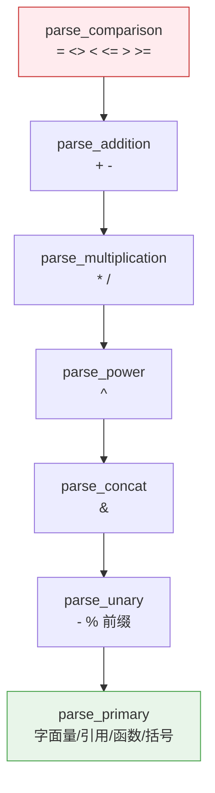
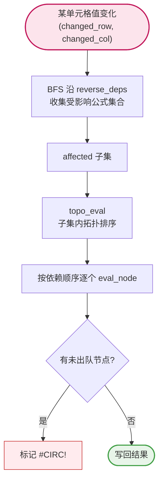
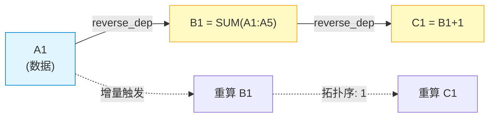

# `excel/formula.rs` 文档

## 1. 文件概述

`src/excel/formula.rs` 是 umya-spreadsheet-excel 项目的**公式解析与求值引擎**。它实现了一套自包含的 Excel 公式计算能力，**不依赖 umya-spreadsheet 的公式功能**，而是直接操作 `reader.rs` 定义的 `SheetData` / `ExcelData`。

该模块完成三件事：

1. **解析（Parse）** —— 用手写的词法分析器（Lexer）+ 递归下降解析器（Parser），把公式字符串（如 `=SUM(A1:A10)+IF(B1>5,C1,D1)`）解析为抽象语法树（AST）。支持预处理：去掉前导 `=`、隐式交叉运算符 `@`、OOXML 新函数前缀 `_xlfn.`。
2. **求值（Evaluate）** —— 基于 AST 对单元格求值，支持运算符优先级（比较 < 加减 < 乘除 < 乘方 < 连接 < 一元）、单元格/范围引用、空值归零、错误传播，以及一批常用函数（`SUM`/`AVERAGE`/`COUNT`/`MAX`/`MIN`/`IF`/`IFS`/`AND`/`OR`/`NOT`/`CONCATENATE`/`SUMIF`/`TODAY`/`ROW` 等）。求值结果写回 `cell.value`。
3. **行列偏移与映射调整（Adjust）** —— 在插入/删除行列或迁移单元格时，批量改写公式中的引用坐标（`adjust_formula_columns` / `adjust_formula_rows` / `adjust_formula_by_mapping`），正确处理绝对引用 `$` 与字符串字面量。

为高效处理多公式间的依赖关系，模块还实现了**依赖图构建 + 拓扑排序**（Kahn 算法），支持全量求值（`evaluate_sheet`）与增量求值（`evaluate_dependents`），并检测循环依赖（标记 `#CIRC!`）。

> 依赖：`std::collections::{HashMap, HashSet, VecDeque}`、`crate::excel::reader::{ExcelData, SheetData, col_to_letter}`。被 `reader.rs` 的加载流程与编辑操作调用。

## 2. 代码逻辑分析

### 2.1 AST 与值类型

- `FormulaNode`：公式 AST 节点，6 个变体 —— `Number`/`String`/`Boolean`（字面量）、`CellRef { col, row }`、`RangeRef { ... }`、`BinaryOp { op, left, right }`、`UnaryOp { op, operand }`、`Function { name, args }`。
- `BinOp`：`Add/Sub/Mul/Div/Pow/Concat(&)` + 六种比较 `Eq/Neq/Lt/Le/Gt/Ge`。
- `UnOp`：`Negate(-)` / `Percent(%)`。
- `FormulaValue`：求值结果类型 `Number/String/Boolean/Error/Blank`，提供 `to_display`（格式化显示，去尾零）、`as_number`、`as_bool`、`is_error` 等转换。

### 2.2 词法分析器（Lexer）

`Token` 枚举覆盖数字、字符串、标识符、单元格引用（`A1`/`$A$1`）、运算符与标点。`Lexer` 是逐字符状态机，关键方法是 `lex_ident_or_cellref`：用状态机（`0=列前/1=列中/2=列后/3=行中/10=标识符`）区分"单元格引用"与"标识符（函数名/TRUE/FALSE/_xlfn.X）"——只有字母部分 ≤3 位且全大写、后跟数字时才识别为单元格引用，遇到 `_`/`.` 切到标识符模式。

### 2.3 递归下降解析器（Parser）

按运算符优先级自顶向下分层，每层处理一类结合性：

```
parse_comparison  ( = <> < <= > >= )   最低
  └ parse_addition  ( + - )
      └ parse_multiplication  ( * / )
          └ parse_power  ( ^ )
              └ parse_concat  ( & )
                  └ parse_unary  ( - % ) 前缀
                      └ parse_primary  最高
```

- `parse_primary`：处理括号表达式、数字/字符串字面量、`TRUE`/`FALSE`、函数调用（标识符后跟 `(`）、单元格/范围引用。
- `parse_cell_or_range`：单个 `CellRef` 或 `CellRef:CellRef` 范围，自动规范化为 (min,max)。
- `parse_function`：解析 `IDENT ( arg, arg, ... )`，函数名统一转大写。

`parse_cell_ref_str` / `letter_to_col` 把 `"A1"`/`"$A$1"` 解析为 `(col, row)`，剥离 `$`。

### 2.4 公式解析入口 `parse_formula`

去除前导 `=` 与 `@`、替换 `_xlfn.`，然后 `Lexer::tokenize` → `Parser::parse` 得到 AST。

### 2.5 引用偏移调整

四个对称的字符串改写函数，逐字符扫描公式，**跳过字符串字面量**，用正则式 `[$]?[A-Za-z]+[$]?[0-9]+` 匹配单元格引用并重写坐标：

| 函数 | 调整对象 | 阈值与语义 |
|------|----------|------------|
| `adjust_formula_columns(formula, threshold_col, shift)` | 列号 ≥ `threshold_col` 的引用 | 插入/删除列；绝对列 `$A` 在结构性操作中**也偏移** |
| `adjust_formula_rows(formula, threshold_row, shift)` | 行号 ≥ `threshold_row` 的引用 | 插入/删除行；绝对行 `$1` **也偏移**（Excel 行为） |
| `adjust_formula_by_mapping(formula, mapping, fb_col, fb_row)` | 按源→目标映射表替换 | 在映射表中用映射目标（绝对引用保持原位），否则用 fallback 偏移 |
| `shift_formula_relative(formula, d_col, d_row)` | 复制/填充柄：仅平移**相对**引用（无 `$`），绝对引用 `$A`/`$1` 保持不变 | 填充柄拖拽/双击自动填充时复制公式 |

非单元格引用的字母串（如函数名 `SUM`）通过"后跟数字才算引用"的规则被正确跳过。

`shift_formula_relative` 是纯文本级逐字符扫描，匹配 `[$]?[A-Za-z]+[$]?[0-9]+` 模式。`$` 前缀的维度不偏移。跳过字符串字面量 `"..."`。前导 `=`/`@` 原样保留。

### 2.6 求值器

- `get_cell_value(sheet, row, col)`：从 `SheetData` 取值并转 `FormulaValue`。空→`Blank`；能解析数字→`Number`；否则回退 `raw_number`（日期序列号等）或 `parse_date_string`（格式化日期串），最后判断 `TRUE`/`FALSE`/普通字符串。
- `collect_range_values` / `collect_args_values`：展开范围引用为值向量（供 `SUM` 等聚合使用）。
- `eval_node(node, sheet, eval_pos)`：AST 分发。`eval_pos` 是公式所在坐标，供 `ROW()`/`COLUMN()` 使用。
- `eval_unary` / `eval_binary`：算术（空值归 0、除零→`#DIV/0!`、`powf`）、连接 `&`、比较（优先数值比较，否则大小写不敏感字符串比较）。
- `eval_function`：按函数名 `match` 分派。`SUMIF` 用 `matches_criteria`（支持 `>=/<=/<>/></<`=` 前缀与直接相等）+ `compare_value_to_str`/`cmp_str`。`TODAY` 用系统时间算序列号；`ROW` 支持 `ROW()`（当前行）与 `ROW(ref)`。
- 未知函数返回 `#NAME?`。

### 2.7 依赖分析与拓扑求值

- `extract_dependencies(node)`：递归收集 AST 引用的所有单元格。**超大范围（>50000 格）仅标记四角**，避免 `A1:Z100000` 导致依赖集爆炸。
- `build_formula_graph(sheet)`：解析所有公式单元格为 AST，构建 `formula_positions`、正向依赖 `forward_deps`（仅公式间依赖）、反向依赖 `reverse_deps`（任意单元格→依赖它的公式）。
- `topo_eval(...)`：Kahn 拓扑排序——在待求值子集内统计入度，入度为 0 者入队，求值后通过反向表递减后继入度。按拓扑顺序求值并写回 `cell.value`；**未出队的（循环依赖）标记 `#CIRC!`**。

### 2.8 顶层 API

- `evaluate_sheet(sheet)` —— **全量求值**：构建依赖图后对所有公式单元格拓扑求值。用于初始加载或公式本身变更。
- `evaluate_dependents(sheet, changed_row, changed_col)` —— **增量求值**：从变更单元格出发，沿 `reverse_deps` 做 BFS 收集所有受影响公式，再对该子集拓扑求值。避免每帧全量重算。（内部委托 `evaluate_dependents_many`，单格即一次单元素批量。）
- `evaluate_dependents_many(sheet, changed: IntoIterator<Item=(u32,u32)>)` —— **批量增量求值**：语义与 `evaluate_dependents` 一致（只重算依赖公式），但**一次构建依赖图**处理多个变更格。用于填充/粘贴等一次改动多格的场景——**关键性能点**：`build_formula_graph` 为 O(单元格数)，逐格调用 `evaluate_dependents` 在 200 万+ 单元格的大表上为 K × O(2M)（K=改动格数），造成 2~3 秒卡顿；本函数把 K 次图重建收敛为 1 次，K 格改动只建一次图 + 一次拓扑求值。
- **副作用**：上述三者求值时都会置位 `sheet.cf_dirty = true`，作为**条件格式事件驱动刷新**的唯一触发信号（值变化 → 公式求值 → 标脏 → viewer 仅对当前表、仅在脏时重算条件格式）。详见 [reader.md §2.7 事件驱动刷新机制](./reader.md#27-条件格式求值)。

> **性能瓶颈与优化**：所有增量/全量求值入口都先调 `build_formula_graph`（全表扫描 + 逐公式解析，O(单元格数)）。单次调用（如单元格编辑）代价可接受；但「按改动格循环调用」的模式（填充/粘贴的值路径）会把单次开销放大 K 倍。已用 `evaluate_dependents_many` 收敛为一次。**L2 依赖图缓存已实现**（详见 §2.10），采用两级缓存架构：L1 为 `formula_positions` 索引（HashSet，通过 `mark_formula`/`unmark_formula` 增量维护）；L2 为完整依赖图（`CachedFormulaGraph`），存储于 `SheetData.cached_graph`（`Option<Box<dyn Any + Send + Sync>>` 类型擦除以避免与 `reader.rs` 的循环类型依赖）。缓存有效性由 `cached_graph_dirty` 标志控制。当两级缓存均命中时，直接克隆缓存图并返回，性能从 ~300ms 降至 ~5ms（25 万公式单元格场景）。

### 2.9 测试

文件内嵌 `tests` 模块，覆盖：解析（数字/算术/单元格/范围/`$` 引用/`_xlfn.`/`@`）、求值（算术/单元格/`SUM`/`IF`/`IFS`/`CONCATENATE`/除零/日期减法）、循环依赖 `#CIRC!`、链式依赖、增量求值（受影响/不受影响）、**批量增量求值 `evaluate_dependents_many`**、`$` 引用链重算、`TODAY`/`ROW`，以及 `adjust_formula_rows` 的十余个边界用例（绝对/混合/跨越阈值/负偏移/字符串字面量/`@` 前缀等）。

### 2.10 公式依赖图缓存（L2 Cache）

为避免每次求值都全表扫描重建依赖图，实现了两级缓存架构：

**`CachedFormulaGraph` 结构体**：

| 字段 | 类型 | 说明 |
|------|------|------|
| `formula_cells` | `HashMap<(u32,u32), FormulaNode>` | 公式坐标 → 已解析的 AST |
| `forward_deps` | `HashMap<(u32,u32), HashSet<(u32,u32)>>` | 公式 → 它依赖的公式（仅公式间依赖） |
| `reverse_deps` | `HashMap<(u32,u32), HashSet<(u32,u32)>>` | 任意单元格 → 依赖它的公式集合 |

**存储方式**：缓存在 `SheetData.cached_graph: Option<Box<dyn Any + Send + Sync>>`，使用类型擦除（type erasure）以避免 `formula.rs` 与 `reader.rs` 之间的循环类型依赖。

**缓存有效性**：`cached_graph_dirty: bool` 标志控制缓存有效性。

**`build_formula_graph` 两级缓存逻辑**：

```
build_formula_graph(sheet):
  formula_positions_dirty? → rebuild_formula_positions() → dirty=false
  cached_graph_dirty?      → parse all formula cells, build graph, cache it → dirty=false
  both clean               → downcast cached graph, clone and return
```

- **L1 缓存（`formula_positions`）**：`HashSet<(u32,u32)>`，记录所有含公式的单元格坐标。通过 `mark_formula(sheet, row, col)` / `unmark_formula(sheet, row, col)` 增量维护。L1 脏时需全量扫描重建 `formula_positions`。
- **L2 缓存（完整依赖图）**：`CachedFormulaGraph`。L1 干净但 L2 脏时，从 `formula_positions` 出发解析所有公式单元格并构建完整图。L2 脏标记会阻止直接使用缓存图。
- **两级均命中**：直接 `downcast` 缓存图，`clone` 并返回。性能从 ~300ms 降至 ~5ms（25 万公式单元格场景）。

**`invalidate_formula_graph(sheet)`**：将 `cached_graph_dirty` 置为 `true`，使 L2 缓存失效。由 `fill.rs`、`table.rs`、`viewer.rs` 在公式修改时调用，确保下次 `build_formula_graph` 重建依赖图。

## 3. 视觉结构图

### 3.1 解析—求值总管线

```mermaid
flowchart LR
    SRC["公式字符串<br/>=SUM(A1:A5)+B1"] --> PRE["预处理<br/>去 = / @ / _xlfn."]
    PRE --> LEX["Lexer::tokenize<br/>词法分析"]
    LEX --> TK["Token 流"]
    TK --> PAR["Parser (递归下降)<br/>按优先级分层"]
    PAR --> AST["FormulaNode AST"]

    AST --> DEP["build_formula_graph<br/>提取依赖 + 拓扑排序"]
    DEP --> EV["eval_node<br/>递归求值"]
    EV --> WRT[("写回 cell.value")]

    style SRC fill:#e1f5fe,stroke:#0288d1
    style AST fill:#fff9c4,stroke:#f9a825,stroke-width:2px
    style EV fill:#e8f5e9,stroke:#43a047,stroke-width:2px
```



### 3.2 运算符优先级（解析层级）



### 3.3 增量求值的依赖传播



### 3.4 依赖图与求值顺序示例

以 `B1=SUM(A1:A5)`、`C1=B1+1` 为例，修改 `A1` 后的传播：



## 4. 关键类型与函数清单

### 4.1 公开枚举（pub enum）

| 枚举 | 变体 | 用途 |
|------|------|------|
| `FormulaNode` | Number/String/Boolean/CellRef/RangeRef/BinaryOp/UnaryOp/Function | 公式 AST 节点 |
| `BinOp` | Add/Sub/Mul/Div/Pow/Concat/Eq/Neq/Lt/Le/Gt/Ge | 二元运算符 |
| `UnOp` | Negate/Percent | 一元运算符 |
| `FormulaValue` | Number/String/Boolean/Error/Blank | 求值结果 |

### 4.2 主要公开函数（pub fn）

| 函数 | 签名摘要 | 用途 |
|------|----------|------|
| `parse_formula` | `(input: &str) -> Result<FormulaNode, String>` | 公式字符串→AST（含预处理） |
| `letter_to_col` | `(s: &str) -> Result<u32, String>` | 列字母→列号（A=1, AA=27） |
| `parse_cell_ref_input` | `(s: &str) -> Option<(u32, u32)>` | 用户输入单元格引用→(col,row) |
| `adjust_formula_columns` | `(formula, threshold_col, shift) -> String` | 调整列引用（插入/删除列） |
| `adjust_formula_rows` | `(formula, threshold_row, shift) -> String` | 调整行引用（插入/删除行） |
| `adjust_formula_by_mapping` | `(formula, mapping, fb_col, fb_row) -> String` | 按映射表调整引用（迁移） |
| `shift_formula_relative` | `(formula, d_col, d_row) -> String` | 填充柄复制：仅平移相对引用，绝对引用 `$A`/`$1` 不变 |
| `invalidate_formula_graph` | `(sheet: &mut SheetData)` | 使 L2 依赖图缓存失效（`cached_graph_dirty = true`），由 fill/table/viewer 在公式修改时调用 |
| `evaluate_sheet` | `(sheet: &mut SheetData)` | 全量拓扑求值所有公式；并置位 `cf_dirty` |
| `evaluate_dependents` | `(sheet, changed_row, changed_col)` | 增量求值受影响公式（单格）；委托 `evaluate_dependents_many`；并置位 `cf_dirty` |
| `evaluate_dependents_many` | `(sheet, changed: IntoIterator<Item=(u32,u32)>)` | **批量**增量求值（多格改动一次建图）；填充/粘贴值路径用；并置位 `cf_dirty` |

### 4.3 关键内部函数（私有 fn）

| 函数 | 用途 |
|------|------|
| `Lexer::tokenize` / `lex_ident_or_cellref` | 词法分析，区分单元格引用与标识符 |
| `Parser::parse_comparison` ... `parse_primary` | 递归下降分层解析 |
| `parse_cell_ref_str` | `"A1"`/`"$A$1"`→(col,row) |
| `format_number` | 数字格式化（去尾零、NaN/Inf 错误码） |
| `get_cell_value` | 单元格值→FormulaValue（含日期回退） |
| `collect_range_values` / `collect_args_values` | 展开范围为值向量 |
| `eval_node` / `eval_unary` / `eval_binary` | AST 求值分发 |
| `eval_function` | 按函数名分派（SUM/IF/IFS/SUMIF/TODAY/ROW…） |
| `matches_criteria` / `compare_value_to_str` / `cmp_str` | SUMIF 条件判定 |
| `extract_dependencies` | 提取 AST 依赖（大范围仅取四角） |
| `build_formula_graph` | 构建 AST 表 + 正/反向依赖（含 L1/L2 两级缓存） |
| `topo_eval` | Kahn 拓扑排序求值 + 循环依赖检测 |

### 4.4 支持的函数清单

| 函数 | 说明 |
|------|------|
| `SUM` / `AVERAGE` / `COUNT` / `MAX` / `MIN` | 聚合（展开范围） |
| `IF` / `IFS` | 条件分支 |
| `AND` / `OR` / `NOT` | 逻辑运算 |
| `CONCATENATE` | 字符串连接 |
| `SUMIF` | 条件求和（支持比较前缀） |
| `TODAY` | 当前日期序列号 |
| `ROW` | 当前行号 / 引用行号 |

> 未识别函数返回错误值 `#NAME?`；除零返回 `#DIV/0!`；独立范围在表达式上下文返回 `#VALUE!`；循环依赖标记 `#CIRC!`。
