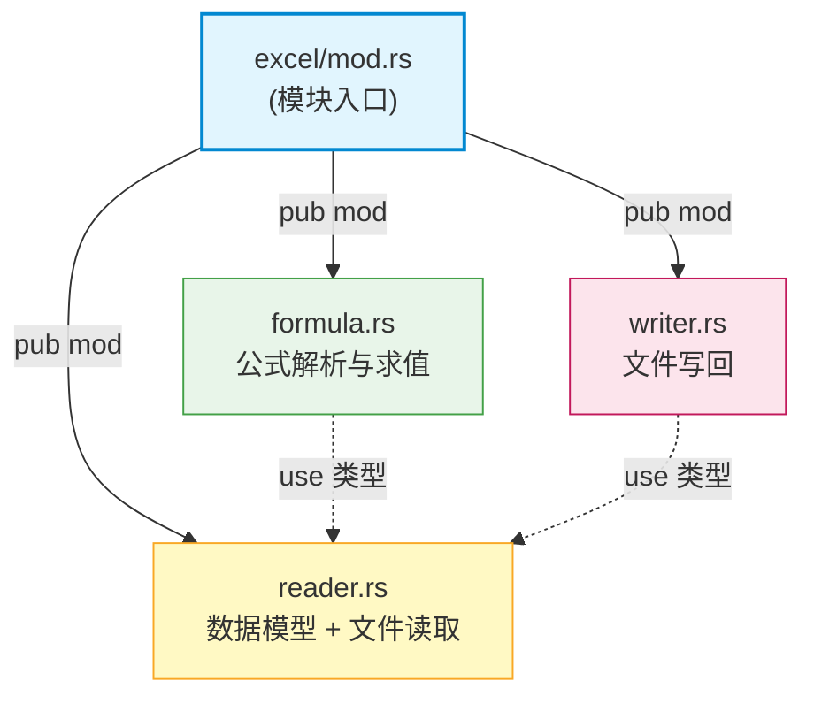

# `excel/mod.rs` 文档

## 1. 文件概述

`src/excel/mod.rs` 是 **umya-spreadsheet-excel** 项目中 `excel` 子模块的**入口与组织文件**（module root）。

它的职责非常单一：声明并公开（`pub mod`）该目录下的三个子模块，使上层（`main.rs` 等）能够通过 `crate::excel::xxx` 路径访问 Excel 相关的全部能力。该文件本身不包含任何业务逻辑、类型定义或函数实现，仅作为模块树的"目录节点"存在，是整个 Excel 功能的统一门面（facade）。

它将一个庞大复杂的"Excel 读写+公式求值"能力拆分为三个关注点相互独立的子模块，体现了**关注点分离（Separation of Concerns）**的设计思想。

| 子模块 | 职责定位 | 依赖方向 |
|--------|----------|----------|
| `reader` | 数据模型定义 + Excel 文件解析读取（`xlsx` → 内存结构） | 被 `writer`、`formula` 依赖 |
| `formula` | 公式解析、求值、行列偏移调整 | 依赖 `reader` 的 `ExcelData`/`SheetData` |
| `writer` | 将内存数据写回 Excel 文件（内存结构 → `xlsx`） | 依赖 `reader` 的数据类型 |

## 2. 代码逻辑分析

文件仅 3 行有效代码，逻辑结构如下：

```rust
pub mod reader;
pub mod formula;
pub mod writer;
```

### 模块声明

- **`pub mod reader;`** —— 公开读取模块。这是整个 Excel 功能的**基石**：它定义了所有核心数据结构（`ExcelData`、`SheetData`、`CellData` 等），并负责把磁盘上的 `.xlsx` 文件解析为内存中的 `ExcelData`。另外两个子模块都建立在这些类型之上。
- **`pub mod formula;`** —— 公开公式模块。实现了一个完整的递归下降公式解析器与求值器，支持基本运算符、单元格/范围引用、常见函数（`SUM`、`IF`、`IFS`、`SUMIF` 等），并基于依赖图做拓扑排序求值。
- **`pub mod writer;`** —— 公开写入模块。负责把修改后的 `ExcelData` 写回新的 `.xlsx` 文件，完整保留原始格式属性（合并、公式、样式、数据有效性、列宽行高、冻结窗格、边框等）。

### 依赖关系说明

注意声明顺序为 `reader → formula → writer`，这恰好反映了**编译期与逻辑依赖的自然顺序**：
1. `reader` 定义类型 → 无内部依赖；
2. `formula` 使用 `reader::{ExcelData, SheetData, col_to_letter}` → 依赖 `reader`；
3. `writer` 使用 `reader::{ExcelData, SheetData, ...}` 等类型 → 依赖 `reader`。

由于 Rust 的模块系统允许前向引用，声明顺序不影响编译，但该顺序便于阅读者按"数据来源 → 计算 → 持久化"的脉络理解整个子系统。

## 3. 视觉结构图

### 3.1 子模块组织与依赖关系



### 3.2 数据流：从文件到文件

下图展示 `mod.rs` 组织的三个子模块在整个 Excel 数据生命周期中的协作关系：


## 4. 关键类型与函数清单

`mod.rs` 本身**不定义任何类型或函数**，仅做模块声明，因此无清单。

> 模块导出的所有类型与函数请参阅对应子模块文档：
> - [`reader.md`](./reader.md)
> - [`formula.md`](./formula.md)
> - [`writer.md`](./writer.md)
