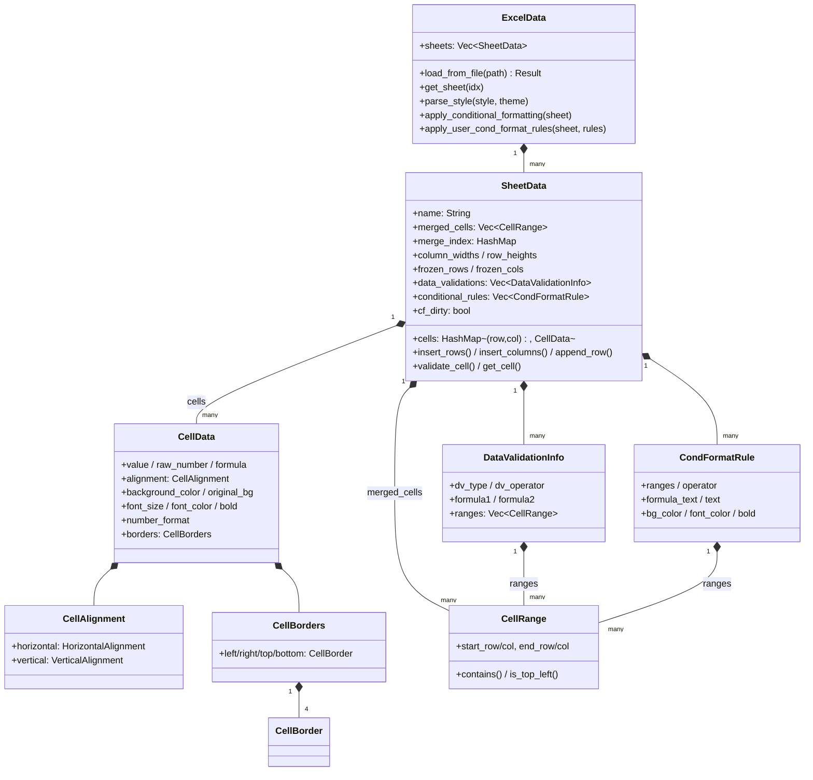
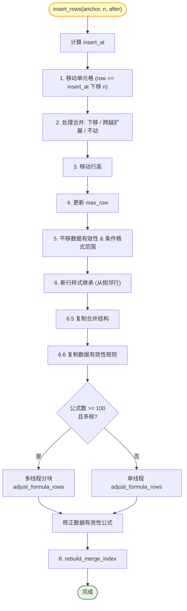
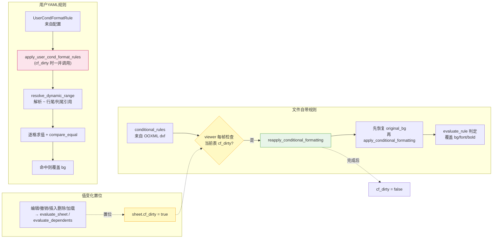

# `excel/reader.rs` 文档

## 1. 文件概述

`src/excel/reader.rs` 是 umya-spreadsheet-excel 项目的**核心基石模块**，承担两大职责：

1. **数据模型定义** —— 定义了整个 Excel 子系统（以及 GUI 层）所使用的全部核心数据结构，包括工作簿 `ExcelData`、工作表 `SheetData`、单元格 `CellData`，以及对齐方式、边框、数据有效性、条件格式、合并区域、列宽行高等辅助结构。`formula.rs` 与 `writer.rs` 均建立在这些类型之上。
2. **Excel 文件读取解析** —— `ExcelData::load_from_file` 负责将磁盘上的 `.xlsx` 文件经由 `umya-spreadsheet` 库解析为内存中的 `ExcelData`，提取单元格值/公式、样式（字体、颜色、对齐、边框、数字格式）、合并区域、列宽行高、冻结窗格、数据有效性、条件格式规则，并立即对所有公式求值、应用条件格式。

此外，该文件还实现了：
- **工作表编辑操作**：`insert_rows` / `insert_columns` / `append_row`，含多线程并行公式偏移、样式与合并结构继承。
- **数据有效性校验**：`validate_cell`，按规则类型对用户输入做实时校验。
- **条件格式求值**：文件自带规则（`apply_conditional_formatting`）与用户 YAML 规则（`apply_user_cond_format_rules`）。
- **日期处理**：Excel 序列号 ↔ 公历日期互转、格式化、字符串解析。

> 依赖：`umya_spreadsheet`（IO 与底层 OOXML 模型）、`std::collections::HashMap`。被 `formula.rs`、`writer.rs` 及 GUI 层广泛引用。

## 2. 代码逻辑分析

### 2.1 对齐方式枚举

`HorizontalAlignment`（8 种）与 `VerticalAlignment`（5 种）以 `Copy` 枚举形式镜像 Excel OOXML 的对齐取值，供样式读写时双向映射使用。

### 2.2 样式相关结构

| 结构 | 说明 |
|------|------|
| `CellAlignment` | 水平+垂直对齐（外加 `indent`/`text_wrap`，当前为预留字段）。默认 `General`/`Bottom`。 |
| `CellBorder` | 单边边框：`style`（如 `"thin"`）+ 颜色 RGB 元组。 |
| `CellBorders` | 四边边框（left/right/top/bottom）。 |

`CellData` 是**单元格的完整表示**，集中了显示值 `value`、原始数值 `raw_number`（日期序列号等，供公式计算）、`formula`、对齐、背景色（含条件格式应用前的 `original_bg`）、字体大小/颜色/加粗、数字格式、边框。

### 2.3 区域与数据有效性

- `CellRange`：合并区域/有效性范围，1-based `(start_row, start_col, end_row, end_col)`，提供 `contains`、`is_top_left`。
- `DataValidationType` / `DataValidationOperator`：镜像 OOXML 的 8 种有效性类型与 8 种运算符。
- `DataValidationInfo`：一条完整有效性规则（提示、错误、类型、运算符、formula1/2、适用范围）。

### 2.4 列复制选项

`ColumnCopyOptions` 控制插入列时从源列复制哪些内容（`copy_merge` / `copy_formula` / `copy_style` / `copy_value`），默认仅复制样式。

### 2.5 `SheetData` —— 工作表模型

`SheetData` 是工作表的内存表示，字段包括：单元格表 `cells: HashMap<(row,col), CellData>`、合并列表 `merged_cells` 与**合并索引 `merge_index`**（O(1) 查找替代 O(n) 扫描）、`max_row`/`max_col`、`column_widths`/`row_heights`、`frozen_rows`/`frozen_cols`、`data_validations`、`conditional_rules`，以及条件格式脏标志 `cf_dirty`（见 [2.7 事件驱动刷新机制](#27-条件格式求值)）。

核心方法分组：

**查询类**
- `get_cell(row, col)` —— 取单元格。
- `get_merged_range(col, row)` —— 经 `merge_index` O(1) 查所在合并范围。
- `get_input_message(col, row)` —— 查单元格的输入提示。
- `get_column_merge(col)` —— 查包含某列的跨列合并。

**校验类**
- `validate_cell(col, row, input)` —— 按有效性类型校验输入，失败返回错误标题/消息。内部委托 `validate_number`。

**编辑类（重点）**
- `insert_rows(anchor_row, n, after)` —— 插入 N 行。流程：(1) 移动单元格；(2) 处理合并（整体下移/跨越扩展/不动）；(3) 移动行高；(4) 更新 `max_row`；(5) 平移数据有效性与条件格式范围；(6) 新行样式继承；(6.5) 复制合并结构；(6.6) 复制数据有效性；(7) **多线程并行**修正公式行引用（≥100 个公式且多核时分块 `std::thread`）；(8) 重建合并索引。
- `append_row()` —— 表尾追加一行。与 `insert_rows(max_row,1,true)` 的关键差异：用 `old_max_row` 作为公式阈值，使 `=SUM(B15:B199)` 能扩展为 `=SUM(B15:B200)`，把新行纳入聚合范围。同样多线程处理公式。
- `insert_columns(anchor_col, m, after, options)` —— 插入 M 列。分 **Phase A（结构性移动）** 与 **Phase B（复制内容到新列）** 两阶段：Phase A 平移单元格/合并/列宽/有效性/条件格式范围并修正公式列引用；Phase B 按选项从源列复制值/公式（带偏移）/样式/合并/有效性。处理了左右插入时公式偏移方向相反的复杂语义。

### 2.6 `ExcelData` —— 工作簿模型与加载流程

`ExcelData { sheets: Vec<SheetData> }` 是整个工作簿。核心入口 `load_from_file(path)` 流程：

1. `reader::xlsx::read(path)` 读入底层 `Workbook`，取 `theme` 用于解析主题色。
2. 遍历每个 `worksheet`，构造 `SheetData`，按 `highest_row/column` 设定边界。
3. **单元格解析（含多线程加速）**：单元格数 ≥ 5000 时用 `std::thread::scope` 分块并行；每块带本地样式缓存 `local_cache`（以样式指纹为键，避免对同样式单元格重复解析），否则顺序解析。样式解析委托 `parse_style`。
4. 读取合并区域（剔除越界范围）、列宽行高（仅 > 0）、冻结窗格（`PaneStateValues::Frozen/FrozenSplit`，注意 umya 命名与 OOXML 的 xSplit/ySplit 对照）。
5. 读取数据有效性（仅 `show_input` 或 `show_error` 启用的规则）。
6. 读取条件格式（`CellIs` 等）的 dxf 样式，组装 `CondFormatRule`。
7. 读取单元格批注：遍历 `worksheet.comments()`，解析作者 + 富文本/纯文本，挂载到 `CellData.comment`（详见 [批注专题](./comments.md)）。
8. 工作表非空校验后，对每个 sheet `rebuild_merge_index` + `formula::evaluate_sheet` + `apply_conditional_formatting`。

**样式解析 `parse_style`**：从 `umya_spreadsheet::Style` 提取对齐、背景色（`argb_with_theme` 自动解析主题色与 tint）、字体大小/颜色/加粗、四边边框、数字格式，返回七元组。颜色统一经 `parse_hex_color` 转 RGB（容错处理非标准长度与 tint 溢出）。

### 2.7 条件格式求值

- `apply_conditional_formatting(sheet)`：克隆规则后，**只遍历已存在的单元格**（`sheet.cells` 稀疏），按范围包含关系（`CellRange::contains`）过滤并用 `evaluate_rule` 判定，命中则覆盖背景/字色/加粗。**复杂度 O(非空格数) 而非 O(范围面积)**——避免对大范围（如 5000×400 预警范围 = 200 万格）逐格 HashMap 查找的卡顿。
- `evaluate_rule(rule, cell_value)`：按 `rule_type`/`operator` 分支，支持 `ContainsText`（含 `extract_contains_text_from_formula` 从 `SEARCH("...")` 提取文本）、`Greater/Less/Equal/NotEqual/Between` 等比较。
- `reapply_conditional_formatting(sheet)`：重算入口——先恢复范围内**已存在**单元格的原始样式（`original_bg`），再调用 `apply_conditional_formatting` 重新求值。**何时调用由 viewer 的事件驱动逻辑决定（见下）**，不再每帧无条件执行。
- `apply_user_cond_format_rules(sheet, rules)`：应用用户 YAML 规则（`UserCondFormatRule`）。先经 `resolve_dynamic_range` 解析动态引用（`~行号`→行尾列、`列字母~`→列尾行、纯 `~`→右下角），再**只遍历该范围内已存在的单元格**用 `compare_equal` 等求值并着色（同样稀疏，避免按范围面积遍历空格）。

#### 事件驱动刷新机制（`SheetData.cf_dirty`）

条件格式（文件自带 + 用户规则）的重新求值是**较重的操作**（遍历每条规则 × 每个范围 × 每个单元格）。原先 viewer 每帧对所有工作表无条件重算，滚动/编辑间隙都在浪费。改为**事件驱动**：

- **脏标志**：`SheetData.cf_dirty: bool`。置位表示"本表的条件格式需要重算（值或用户规则可能已变）"。
- **置位方（值变化的唯一 chokepoint）**：`crate::excel::formula::evaluate_sheet` 与 `evaluate_dependents` 在求值时置位 `sheet.cf_dirty = true`。由于本应用**所有**单元格值变化（编辑、撤销/重做、插入/删除行列、粘贴、加载）都经过这两个函数，置位点集中、可靠。
- **消费方（viewer.rs 每帧）**：仅对**当前表**检查；若 `cf_dirty` 为真则执行 `reapply_conditional_formatting` +（有用户规则时）`apply_user_cond_format_rules`，完成后清零标志。用户规则若本轮被编辑（快照对比检测），则把所有表标记为脏，切换到对应表时再重算。
- **首帧/加载**：`load_from_file` 内部对每个表调用 `evaluate_sheet`，已将各表置脏，故加载后首帧会自动应用（含启动时从配置加载的用户规则）。

| 场景 | 是否重算 CF | 说明 |
|------|------------|------|
| 编辑单元格 | 是（下一帧） | evaluate → cf_dirty |
| 撤销 / 重做 | 是 | undo 内部调 evaluate |
| 插入 / 删除行列 | 是 | 调用方调 evaluate |
| 加载文件 | 首帧是 | load 内部 evaluate 置脏 |
| 增删用户 CF 规则 | 是 | 快照对比 → 标记所有表脏 |
| 切换工作表 | 目标表若脏则重算 | 仅当前表被处理 |
| 滚动 / 闲置 | **否** | 无 evaluate，颜色保持（**主要收益**） |

> 性能：对含条件格式的文件，滚动/闲置期间条件格式计算量下降约一个数量级；不含条件格式的表 `reapply_conditional_formatting` 本就走早返回快路径，收益较小。`cf_dirty` 是瞬时 UI 标志，不参与 xlsx 序列化。
>
> **稀疏遍历（性能关键）**：三个求值函数（`apply_conditional_formatting` / `reapply_conditional_formatting` / `apply_user_cond_format_rules`）都**遍历已存在的单元格 `sheet.cells`**（稀疏，仅非空格），而非按 `range.start..end` 的行列双重循环遍历"范围面积"。原因：`sheet.cells` 来自 OOXML，仅含非空格（稀疏）；而条件/预警范围常覆盖整张表（如 5000×400 = 200 万格），按面积遍历会每格做一次 HashMap 查找，单次重算可达 ~1 秒。稀疏遍历把复杂度从 O(范围面积) 降到 O(非空格数)。空格本就无 `CellData`、不会被着色/恢复，故稀疏遍历与原逻辑结果完全一致。修改 CF 求值时务必保持这一稀疏模式。

### 2.8 日期处理

- `is_date_format(fmt)`：检测数字格式是否为日期（含 y/d，或含 m 但不含 h/s），过滤方括号区域与引号内容。
- `format_date(serial, fmt)`：序列号→格式化字符串。先 `serial_to_date` 得 (y,m,d)，清洗格式后 `normalize_date_format_order` 把美式 `m/d/yyyy` 重排为中文 `yyyy/m/d`，再逐字符展开 y/m/d（含 `mmm` 月份缩写、`ddd` 星期缩写，星期由 Unix days mod 7 计算）。
- `serial_to_date` / `date_to_serial`：基于 Howard Hinnant 的 `civil_from_days` 算法及其逆算法，处理 Excel 1900 纪元（Unix epoch=25569）。
- `parse_date_string(s)`：把 `yyyy/m/d`、`yyyy年m月d日`、`m/d/yyyy` 等解析回序列号，依据首/尾数值大小推断年月日顺序。

### 2.9 工具函数

- `col_to_letter(col)` —— 列号→Excel 列名（1→A，27→AA），被 `writer` 与 `formula` 复用。
- `validate_number(...)` —— 数据有效性数值比较辅助，支持 `date_mode`（formula 也按日期解析）。

### 2.10 测试

文件内嵌 `cond_fmt_tests` 模块，验证两条用户条件格式规则在非重叠范围内独立应用（`B7<=60` 与 `B8="充足"`）。

## 3. 视觉结构图

### 3.1 核心数据结构关系



### 3.2 文件加载主流程

```mermaid
flowchart TD
    A(["load_from_file(path)"]) --> B["reader::xlsx::read<br/>得到 Workbook + theme"]
    B --> C{"遍历每个 worksheet"}
    C --> D["构造 SheetData<br/>highest_row/col"]
    D --> E{"cells.len() >= 5000?"}
    E -- 是 --> F["多线程分块并行解析<br/>(每块本地样式缓存)"]
    E -- 否 --> G["顺序解析 + 样式缓存"]
    F --> H["parse_style 提取样式<br/>→ CellData"]
    G --> H
    H --> I["读取合并/列宽/行高/冻结窗格<br/>数据有效性/条件格式规则"]
    I --> C
    C -- 全部完成 --> J{"sheets 非空?"}
    J -- 否 --> K[/"Err: 没有工作表"/]
    J -- 是 --> L["每个 sheet:<br/>rebuild_merge_index"]
    L --> M["formula::evaluate_sheet<br/>求值全部公式"]
    M --> N["apply_conditional_formatting<br/>应用文件自带条件格式"]
    N --> O([/"Ok(ExcelData)"/])

    style A fill:#e1f5fe,stroke:#0288d1,stroke-width:2px
    style O fill:#e8f5e9,stroke:#43a047,stroke-width:2px
    style K fill:#ffebee,stroke:#c62828
```

### 3.3 插入行/列的处理管线（以 `insert_rows` 为例）



### 3.4 条件格式双轨求值



## 4. 关键类型与函数清单

### 4.1 公开枚举（pub enum）

| 枚举 | 变体 | 用途 |
|------|------|------|
| `HorizontalAlignment` | General/Left/Center/Right/Fill/Justify/CenterContinuous/Distributed | 水平对齐方式，镜像 OOXML 取值 |
| `VerticalAlignment` | Top/Center/Bottom/Justify/Distributed | 垂直对齐方式 |
| `DataValidationType` | None/Whole/Decimal/List/Date/Time/TextLength/Custom | 数据有效性类型 |
| `DataValidationOperator` | Between/NotBetween/Equal/NotEqual/GreaterThan/GreaterThanOrEqual/LessThan/LessThanOrEqual | 数据有效性运算符 |

### 4.2 公开结构体（pub struct）

| 结构体 | 关键字段 | 用途 |
|--------|----------|------|
| `CellAlignment` | horizontal, vertical, indent, text_wrap | 单元格对齐方式 |
| `CellBorder` | style, color | 单边边框 |
| `CellBorders` | left/right/top/bottom | 单元格四边边框 |
| `CellData` | value, raw_number, formula, alignment, background_color/original_bg, font_size/color, bold, number_format, borders, comment | 单元格完整数据 |
| `CellComment` | author, text | 单元格批注（作者 + 富文本/纯文本全文） |
| `CellRange` | start_row/col, end_row/col | 合并/有效性区域，1-based |
| `DataValidationInfo` | dv_type, dv_operator, formula1/2, ranges, prompt/error 等 | 一条有效性规则 |
| `ColumnCopyOptions` | copy_merge, copy_formula, copy_style, copy_value | 插入列时的复制选项 |
| `SheetData` | cells, merged_cells, merge_index, column_widths, row_heights, frozen_*, data_validations, conditional_rules, cf_dirty | 工作表模型 |
| `UserCondFormatRule` | operator, value, color, range | 用户 YAML 条件格式规则 |
| `CondFormatRule` | ranges, operator, formula_text, text, bg_color, font_color, bold | 文件自带条件格式规则 |
| `ExcelData` | sheets | 工作簿模型 |

### 4.3 主要公开函数与方法（pub fn / pub method）

| 函数/方法 | 所属 | 用途 |
|-----------|------|------|
| `col_to_letter(col)` | 模块级 | 列号→列名（1→A, 27→AA） |
| `CellRange::new` / `contains` / `is_top_left` | impl CellRange | 构造与坐标判定 |
| `ColumnCopyOptions::new` | impl ColumnCopyOptions | 构造复制选项 |
| `SheetData::new` | impl SheetData | 构造空工作表 |
| `SheetData::rebuild_merge_index` | impl SheetData | 重建合并索引（O(1) 查找） |
| `SheetData::get_cell` | impl SheetData | 取单元格 |
| `SheetData::get_merged_range` | impl SheetData | 查所在合并范围 |
| `SheetData::get_input_message` | impl SheetData | 查输入提示 |
| `SheetData::validate_cell` | impl SheetData | 校验用户输入 |
| `SheetData::get_column_merge` | impl SheetData | 查跨列合并 |
| `SheetData::default_insert_count` | impl SheetData | 默认插入数量（合并跨度） |
| `SheetData::insert_rows` | impl SheetData | 插入 N 行（含并行公式偏移） |
| `SheetData::append_row` | impl SheetData | 表尾追加行（公式范围扩展） |
| `SheetData::insert_columns` | impl SheetData | 插入 M 列（Phase A/B） |
| `ExcelData::load_from_file` | impl ExcelData | **核心入口**：解析 xlsx 为内存结构 |
| `ExcelData::parse_style` | impl ExcelData（私有） | 提取样式为七元组 |
| `ExcelData::parse_hex_color` | impl ExcelData（私有） | 十六进制色→RGB |
| `ExcelData::reapply_conditional_formatting` | impl ExcelData | 条件格式重算入口（viewer 仅在 `cf_dirty` 时对当前表调用） |
| `ExcelData::apply_user_cond_format_rules` | impl ExcelData | 应用用户 YAML 条件格式 |
| `ExcelData::is_date_format` | impl ExcelData | 判断是否日期格式 |
| `ExcelData::format_date` | impl ExcelData | 序列号→格式化日期串 |
| `ExcelData::date_to_serial` | impl ExcelData | (y,m,d)→序列号 |
| `ExcelData::parse_date_string` | impl ExcelData | 日期串→序列号 |
| `ExcelData::get_sheet` | impl ExcelData | 按索引取工作表 |
| `validate_number` | 模块级（私有） | 数据有效性数值比较辅助 |
| `extract_comment_text` | 模块级（私有） | 从 `CommentText` 提取完整批注文本（plain + rich run 拼接） |

> 说明：标记"私有"的函数虽非 `pub`，但属于文件内部逻辑的关键环节，一并列出以便理解数据流。
