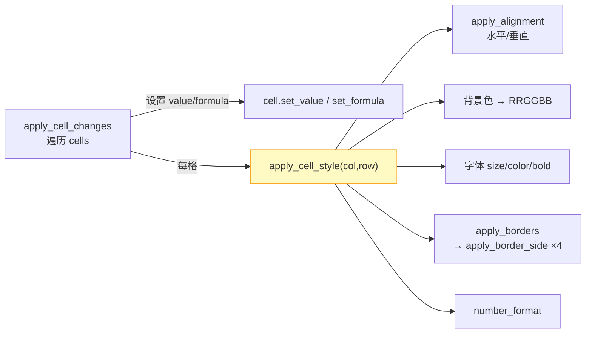
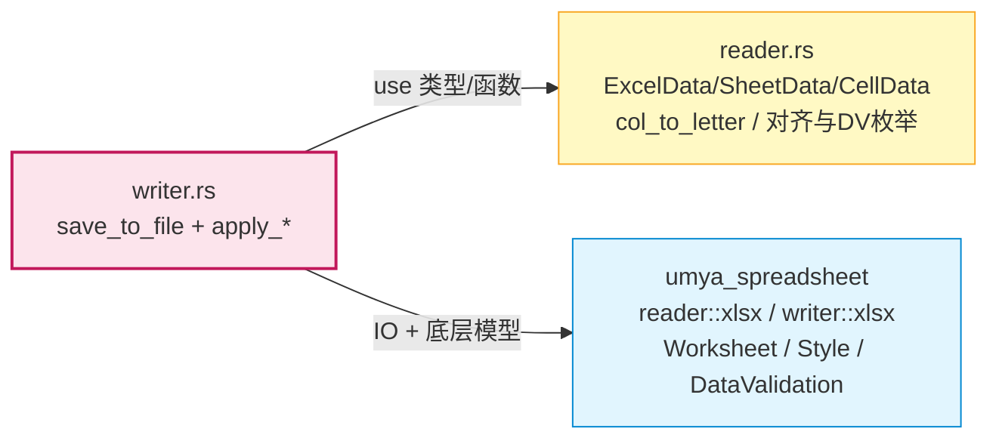

# `excel/writer.rs` 文档

## 1. 文件概述

`src/excel/writer.rs` 是 umya-spreadsheet-excel 项目的**文件写入模块**，负责将内存中的 `ExcelData`（由 `reader.rs` 定义）序列化回磁盘上的 `.xlsx` 文件。

该模块的核心设计思想是 **"重读 + 增量覆盖"**：写入时并不从零构造一个全新的 `Workbook`，而是**重新读取原始导入文件**以获得完整的底层 `Workbook` 对象（从而完整保留原始文件的所有未显式建模的属性），然后逐工作表、逐项地把 `ExcelData` 中的变更（结构 + 内容 + 样式）"叠加"回这个 `Workbook`，最后调用 `umya_spreadsheet::writer::xlsx::write` 写出新文件。

明确保留的原始属性包括：单元格合并、公式、样式、数据有效性、字体大小/颜色、单元格背景色、列宽与行高、冻结区域、单元格边框。

> 依赖：`umya_spreadsheet::{reader, writer}`（读原始文件 + 写新文件）、`super::reader::*`（复用数据类型与 `col_to_letter`）。本模块只暴露一个公开入口 `save_to_file`，其余均为私有辅助函数。

## 2. 代码逻辑分析

### 2.1 公开入口 `save_to_file`

```rust
pub fn save_to_file(original_path: &str, excel_data: &ExcelData, output_path: &str) -> Result<(), String>
```

执行三步：
1. `reader::xlsx::read(original_path)` —— **重读原始文件**得到 `Workbook`（保留全部原始格式属性）。
2. 按 `sheet_idx` 遍历 `excel_data.sheets` 与 `book.sheet_collection_mut()`，对每个工作表依次调用 7 个 `apply_*` 函数：
   - `apply_structural_changes` —— 结构变更（插入行/列）
   - `apply_cell_changes` —— 单元格值+公式+样式
   - `apply_merge_changes` —— 合并单元格
   - `apply_data_validations` —— 数据有效性
   - `apply_column_widths` —— 列宽
   - `apply_row_heights` —— 行高
3. `writer::xlsx::write(&book, output_path)` —— 写出新文件。

### 2.2 结构变更 `apply_structural_changes`

通过比较**原始 Workbook 的 `highest_row/column`** 与 **`SheetData.max_row/max_col`**，推断需要新增的行/列数量，调用 umya 的 `insert_new_column_by_index` / `insert_new_row` 在尾部追加。umya 的这两个方法会自动移动现有数据并调整公式引用，因此必须**先于** `apply_cell_changes` 执行，使后续写入落到正确的坐标。

### 2.3 单元格写入管线

```
apply_cell_changes  ──┬─► 设置 value / formula（空值清空）
                      └─► apply_cell_style(col, row, cell_data)
                              ├─► apply_alignment       (水平/垂直对齐)
                              ├─► 背景色 (RGB → "{:02X}{:02X}{:02X}")
                              ├─► 字体: size / color(ARGB) / bold
                              ├─► apply_borders ─► apply_border_side ×4 (left/right/top/bottom)
                              └─► 数字格式 number_format
```

- **`apply_cell_changes`**：遍历 `sheet_data.cells`，用 `cell_mut((col, row))` 取目标单元格。值与公式皆空时清空，否则写入；非空公式写入 `set_formula`。每格随后调用 `apply_cell_style`。
- **`apply_cell_style`**：取 `style_mut((col, row))`，依次应用对齐、背景色、字体（大小/颜色/加粗）、边框、数字格式。颜色统一格式化为 `RRGGBB`（背景）或 `FFRRGGBB`（字体/边框 ARGB）。
- **`apply_borders` / `apply_border_side`**：四边各调一次，非空 `style` 写入 `border_style`，颜色存在则构造 `Color` 写入。
- **`apply_alignment`**：把 `reader` 的 `HorizontalAlignment`/`VerticalAlignment` 枚举 `match` 映射到 umya 的 `HorizontalAlignmentValues`/`VerticalAlignmentValues`。

### 2.4 合并单元格 `apply_merge_changes`

策略是 **"先清后建"**：`merge_cells_mut().clear()` 清除原始 Workbook 的全部合并，再按 `SheetData.merged_cells` 逐条用 `col_to_letter` 拼成 `"A1:C3"` 区域串调用 `add_merge_cells`。这保证输出文件的合并状态与内存模型完全一致。

### 2.5 数据有效性 `apply_data_validations`

同样 **"先清后建"**：`remove_data_validations()` 清空，随后构造新的 `DataValidations` 对象，对每条 `DataValidationInfo`：
- `dv_type` / `dv_operator` 枚举映射到 umya 取值；
- 写入 `formula1`/`formula2`；
- 设置提示/错误信息与显示开关（`show_input_message` 在有错误开关或提示内容时启用）；
- 把 `ranges` 逐个拼成区域串，组装 `SequenceOfReferences` 后 `set_sequence_of_references`；
- 最后 `add_data_validation_list` 累加，全部完成后 `set_data_validations`。

### 2.6 列宽行高

- `apply_column_widths`：遍历 `column_widths`，`column_dimension_by_number_mut(col).set_width(width)`。
- `apply_row_heights`：遍历 `row_heights`，`row_dimension_mut(row).set_height(height)`。

### 2.7 坐标约定差异

注意本模块中 umya 的单元格访问使用 `(col, row)` 顺序（如 `cell_mut((col, row))`、`style_mut((col, row))`），而 `reader.rs` 内部的 `cells` HashMap 键与多数方法参数使用 `(row, col)` 顺序。写入时需做顺序转换（见 `apply_cell_changes` 中 `(*col, *row)` 的写法）。

## 3. 视觉结构图

### 3.1 写入总体流程

```mermaid
flowchart TD
    A(["save_to_file(original, excel_data, output)"]) --> B["reader::xlsx::read(original)<br/>重读原始文件得到 Workbook"]
    B --> C{"遍历 sheets[index]"}
    C --> D["apply_structural_changes<br/>推断并插入新增行/列"]
    D --> E["apply_cell_changes<br/>写值+公式+样式"]
    E --> F["apply_merge_changes<br/>清空后重建合并"]
    F --> G["apply_data_validations<br/>清空后重建有效性"]
    G --> H["apply_column_widths"]
    H --> I["apply_row_heights"]
    I --> C
    C -- 全部完成 --> J["writer::xlsx::write(book, output)<br/>写出新文件"]
    J --> K([/"Ok(())"/])

    style A fill:#fce4ec,stroke:#c2185b,stroke-width:2px
    style K fill:#e8f5e9,stroke:#43a047,stroke-width:2px
```

### 3.2 单元格写入子流程



### 3.3 模块依赖



## 4. 关键类型与函数清单

### 4.1 公开函数（pub fn）

| 函数 | 签名 | 用途 |
|------|------|------|
| `save_to_file` | `(original_path: &str, excel_data: &ExcelData, output_path: &str) -> Result<(), String>` | **唯一公开入口**：重读原文件→叠加变更→写出新文件 |

### 4.2 内部辅助函数（私有 fn）

| 函数 | 用途 |
|------|------|
| `apply_structural_changes(worksheet, sheet_data)` | 比较 `highest_row/col` 与 `max_row/col`，尾部插入新增行/列 |
| `apply_cell_changes(worksheet, sheet_data)` | 写入单元格值、公式，并触发样式写入 |
| `apply_cell_style(worksheet, col, row, cell_data)` | 应用单个单元格的对齐/背景/字体/边框/数字格式 |
| `apply_borders(style, borders)` | 写入四边边框 |
| `apply_border_side(border, cell_border)` | 写入单边边框样式与颜色 |
| `apply_alignment(style, alignment)` | 枚举映射写入水平/垂直对齐 |
| `apply_merge_changes(worksheet, sheet_data)` | 清空原始合并后按内存模型重建 |
| `apply_data_validations(worksheet, sheet_data)` | 清空原始有效性后按内存模型重建 |
| `apply_column_widths(worksheet, sheet_data)` | 写入列宽 |
| `apply_row_heights(worksheet, sheet_data)` | 写入行高 |

> 本模块**不定义任何 `pub struct` / `pub enum`**，全部数据类型复用自 `reader.rs`（`ExcelData`、`SheetData`、`CellData`、`CellAlignment`、`HorizontalAlignment`、`VerticalAlignment`、`DataValidationType`、`DataValidationOperator`、`CellBorders` 等），并使用 `reader::col_to_letter` 将列号转为列字母。
