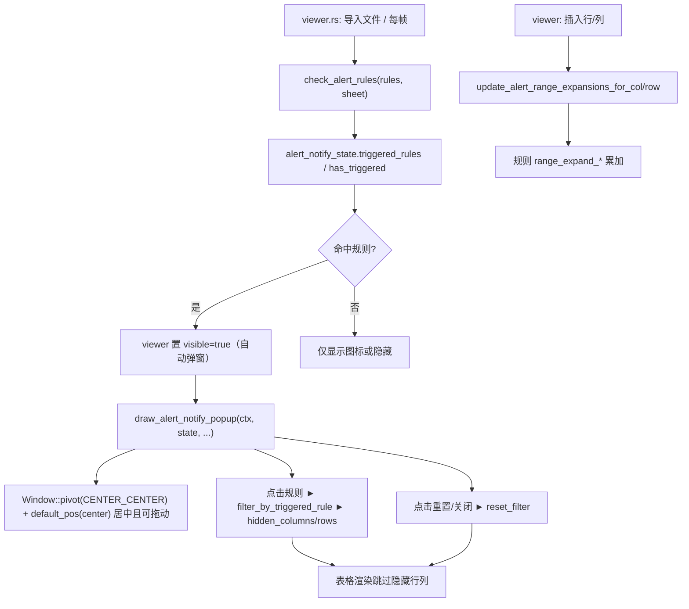

# `gui/widgets/alert_notify.rs` 文档

## 1. 模块概述

`src/gui/widgets/alert_notify.rs` 是**预警规则触发检测与通知**模块。它在 Excel 文件导入（或每帧）
后，依据用户配置的预警规则（`AlertRule`，定义于 [`alert_popup.rs`](alert_popup.md)）扫描当前工作表，
汇总所有"已触发"的规则，并在 GUI 上以**菜单栏右侧的黄色警示图标 + 居中弹窗**形式通知用户；
用户可在弹窗中点击某条规则对表格做横向/纵向过滤，或重置恢复。

### 职责

- **规则触发检测**：解析规则的应用范围字符串（含 `~` 动态范围、固定范围、插入行/列后的偏移扩展），
  遍历范围内单元格，按运算符（`=`/`!=`/`>`/`<`/`>=`/`<=`）与阈值比较，判断是否触发。
- **通知 UI**：绘制菜单栏图标（`draw_alert_icon`）与预警消息弹窗（`draw_alert_notify_popup`），
  弹窗以**主窗口视口中心为基准水平垂直居中**弹出（见 §6）。
- **点击过滤**：点击某条已触发规则 → 隐藏不匹配的列（横向规则）或行（纵向规则），合并单元格按左上角对齐。
- **结构变更联动**：插入/添加行、列后，更新受影响固定规则的 `range_expand_col/row`，使范围自动跟随扩展。

> **与 [`alert_popup.rs`](alert_popup.md) 的关系**：`alert_popup.rs` 负责**预警规则的配置**
> （规则增删改、配置弹窗 UI、`AlertRule` 结构定义、规则持久化）；本模块 (`alert_notify.rs`) 负责
> **消费规则做触发检测 + 通知 + 过滤**。两者通过 `AlertRule` 解耦：`AlertRule` 在 `alert_popup.rs` 定义，
> 在本模块被 `check_alert_rules` / `update_alert_range_expansions_*` 消费。

### 依赖

| 类别 | 依赖 | 用途 |
|------|------|------|
| 外部 crate | `eframe::egui` | `Context`、`Window`、`Area`、`Align2`、`Vec2`、`Ui`、`Painter`、绘图原语 |
| 标准库 | `std::collections::HashSet<u32>` | 隐藏列/行集合（与表格渲染、搜索共用） |
| 内部模块 | `crate::excel::reader::SheetData` | 读取单元格值、`max_col/max_row`、合并单元格 `merged_cells`、`col_to_letter` |
| 内部模块 | `crate::gui::widgets::alert_popup::AlertRule` | 预警规则数据来源（配置侧） |

### 被谁调用

| 调用方 | 调用内容 |
|--------|----------|
| `gui/viewer.rs` | 每帧 `check_alert_rules`（更新 `alert_notify_state`）、`draw_alert_notify_popup`；导入文件后置 `alert_notify_state.visible = true` 自动弹窗；插入行/列时 `update_alert_range_expansions_for_col/row` |
| `gui/widgets/menu_bar.rs` | `draw_alert_icon`（菜单栏最右侧 `right_to_left` 布局） |

---

## 2. 数据结构与类型定义

### 2.1 `TriggeredRule`（已触发的规则条目）

```rust
#[derive(Debug, Clone)]
pub struct TriggeredRule {
    pub message: String,                                  // 规则消息（显示用）
    pub range: String,                                    // 原始范围字符串（如 =B8:~8）
    pub operator: String,                                 // 运算符
    pub value: String,                                    // 阈值
    pub resolved_range: Option<(u32, u32, u32, u32)>,     // 解析后 (start_col, start_row, end_col, end_row)
    pub is_horizontal: bool,                              // true=横向（同行多列），false=纵向（同列多行）
}
```

由 `check_alert_rules` 生成，每个元素代表一条命中的规则；`resolved_range` + `is_horizontal` 供后续
`filter_by_triggered_rule` 决定隐藏哪些列/行。

### 2.2 `AlertNotifyState`（通知弹窗状态，持久化于 `ExcelViewer`）

```rust
#[derive(Debug)]
pub struct AlertNotifyState {
    pub visible: bool,                // 弹窗是否可见
    pub triggered_rules: Vec<TriggeredRule>,  // 当前已触发的规则列表
    pub has_triggered: bool,          // 是否有任意规则触发（控制图标显隐）
    pub is_filtering: bool,           // 当前是否处于"来自预警通知"的过滤状态
    pub collapsed: bool,              // 折叠（仅标题栏）；默认展开
}
```

- `visible` 在导入文件命中规则时被 `viewer.rs` 置 `true`，触发**自动弹窗**；也可由点击图标手动切换。
- 切换工作表 / 关闭弹窗会重置该状态（清空 `triggered_rules`、`has_triggered=false`、`visible=false`）。

---

## 3. 公开接口（pub 函数）

| 函数 | 签名摘要 | 用途 |
|------|----------|------|
| `draw_alert_icon` | `(ui, state: &mut AlertNotifyState)` | 菜单栏右侧绘制 18×18 黄色实心灯泡图标；`has_triggered` 为真才显示；点击切换 `state.visible`（每次打开强制展开） |
| `draw_alert_notify_popup` | `(ctx, state, hidden_columns, hidden_rows, sheet: Option<&SheetData>)` | 绘制预警消息弹窗（标题栏 + 滚动规则列表 + 底部提示）；点击规则调用 `filter_by_triggered_rule`；居中定位（见 §6） |
| `check_alert_rules` | `(rules: &[AlertRule], sheet: &SheetData) -> Vec<TriggeredRule>` | 遍历全部规则，解析范围并检测触发，返回已触发列表 |
| `filter_by_triggered_rule` | `(rule: &TriggeredRule, sheet, hidden_columns, hidden_rows)` | 依规则隐藏不匹配的列（横向）或行（纵向），并做合并单元格对齐 |
| `update_alert_range_expansions_for_col` | `(rules: &mut [AlertRule], insert_col, n, _sheet)` | 插入 `n` 列于 `insert_col` 处后，把受影响固定规则的 `range_expand_col += n`（含 `~` 的动态范围跳过） |
| `update_alert_range_expansions_for_row` | `(rules: &mut [AlertRule], insert_row, n, _sheet)` | 同上，作用于行的 `range_expand_row` |

私有辅助：`compare_equal`、`compare_values`、`parse_alert_range`、`resolve_dynamic_range`、
`parse_cell_ref_str`、`expand_hidden_for_merged_cols/rows`、`reset_filter`。

---

## 4. 核心处理逻辑与数据流

### 4.1 范围解析（`parse_alert_range` → `resolve_dynamic_range` → `parse_cell_ref_str`）

支持的范围字符串格式（`~` 表示动态边界，跟随 `sheet.max_col/max_row`）：

| 格式 | 含义 | 方向 |
|------|------|------|
| `=B8:~8` | B8 到第 8 行最右列 | 横向 |
| `=B8:D8` | B8 到 D8 固定范围 | 横向 |
| `=B8:B~` | B8 到 B 列最底行 | 纵向 |
| `=B8:B12` | B8 到 B12 固定范围 | 纵向 |
| `=B8:~` | 全方向扩展 | 由 `start_row==end_row` 判定 |

- 固定范围（无 `~`）会叠加 `range_expand_col/row` 偏移量到结束边界，实现"插入列/行后范围自动扩展"。
- `is_horizontal = (start_row == end_row)`：同行为横向、否则纵向。

### 4.2 规则触发检测（`check_alert_rules` + `compare_values`）

对每条规则：解析范围 → 沿主轴遍历单元格 → `compare_values(value, operator, threshold)` 命中即标记该规则触发
（一条规则命中一个单元格即足够，`break`）。比较先尝试数值（`f64`），失败回退字符串（忽略大小写/去空白）。

### 4.3 点击过滤（`filter_by_triggered_rule`）

清空 `hidden_columns/hidden_rows` 后，沿规则主轴逐单元格比对：不匹配（含空单元格）的列/行加入隐藏集合；
随后 `expand_hidden_for_merged_cols/rows` 做**合并单元格对齐**——跨列/跨行合并的整组列/行跟随左上角可见性统一，
避免合并区域被部分隐藏而错位。

### 4.4 整体数据流



---

## 5. UI 布局

### 5.1 警示图标（`draw_alert_icon`）

菜单栏最右侧（`right_to_left` 布局）的 18×18px **黄色实心灯泡**：实心圆头部（`#FFC800`）+ 颈部 + 深黄底座
（`#8C6400`）。尺寸每帧恒定，避免布局抖动；悬停提示 `N 条预警规则已触发，点击查看详情`。

### 5.2 预警消息弹窗（`draw_alert_notify_popup`）

```
                  ┌──────────────────────────────┐
                  │ ▼  ⚠ 预警消息      🔄 重置  ✖ │  ← 自定义标题栏（点击 ▼/▶ 折叠展开）
                  │──────────────────────────────│
        居中      │ 规则消息1（红色文字，可点击）  │  ← 滚动列表区（最大高度 180px）
       ◄─视口─►   │ 规则消息2（红色文字，可点击）  │
                  │ ...                          │
                  │ 💡 点击预警消息过滤表格...     │  ← 底部固定提示行（始终可见）
                  └──────────────────────────────┘
```

- 宽度固定 300px；标题栏黄色加粗（`#C89600`）；规则项红色（`Color32::RED`）12px。
- 展开/折叠动画：`egui::animate_value_with_time`（200ms）+ smoothstep 缓动，高度从中心向两侧伸缩。

---

## 6. 弹窗居中定位 + 可拖动的实现方式（重点）

### 6.1 定位代码

`draw_alert_notify_popup` 中用 `egui::Window` 的 **`pivot` + `default_pos`** 组合定位——
既精确居中，又保留鼠标拖动：

```rust
egui::Window::new("alert_notify_popup")
    .title_bar(false)
    .resizable(false)
    .collapsible(false)
    .open(&mut keep_open)
    // pivot(CENTER_CENTER)：窗口中心点作为锚点；default_pos(center)：仅首次出现时把锚点设为视口中心
    .pivot(egui::Align2::CENTER_CENTER)
    .default_pos(ctx.content_rect().center())
    .show(ctx, |ui| { ... });
```

### 6.2 egui 定位 + 拖动的数据流

egui 的 `Area`（`Window` 的基类）定位由两个字段决定（见 egui 0.34 `containers/area.rs`）：

- `pivot: Align2` —— 窗口自身的锚点（默认 `LEFT_TOP`，即左上角）。`pivot(CENTER_CENTER)` 改为窗口**中心**。
- `pivot_pos: Pos2` —— 该锚点要对齐到的**屏幕坐标**。

最终窗口左上角 = `pivot_pos − pivot.to_factor() × size`（`AreaState::left_top_pos`）。
定位与拖动每帧的数据流（`Area::show`）：

1. `state.pivot = self.pivot`（每帧从 `pivot()` 设置 → `CENTER_CENTER`，`to_factor()` 在 x、y 均为 0.5）；
2. `if let Some(new_pos) = new_pos { state.pivot_pos = Some(new_pos) }` —— **仅 `current_pos`/`fixed_pos`/`anchor` 走这条**，
   每帧强制覆盖 `pivot_pos`；`default_pos` **不走这条**。
3. `state.pivot_pos.get_or_insert_with(|| default_pos ...)` —— **仅当 `pivot_pos` 为空（首次出现）时**用 `default_pos`
   填入 `content_rect().center()`；之后 `pivot_pos` 被持久化，不再每帧覆盖。
4. 拖动：`Area` 对**整个窗口矩形** `state.rect()` 建立 `Sense::DRAG` 的 `move` 交互（`movable=true` 时）；
   拖动期间 `state.pivot_pos = 拖动起点的 pivot_pos + total_drag_delta()`（持久化更新）。

故本组合达成：

- **精确居中**：首帧 `pivot_pos = 视口中心`、`pivot = CENTER_CENTER` → 左上角 = `视口中心 − 0.5×尺寸` → 窗口中心落在视口中心。
- **动画仍从中心伸缩**：高度随展开/折叠变化时，`左上角 = 中心 − 0.5×尺寸` 每帧重算，窗口**从中心向上下两侧对称生长/收缩**。
- **可自由拖动**：`movable` 保持默认 `true`（未调用 `anchor`/`fixed_pos`），拖动更新的 `pivot_pos` 不被每帧覆盖，故可拖动；
  且 `move` 交互作用于整个窗口矩形，拖动标题栏或空白处都能移动（点击按钮/规则项等子控件由其自身消费，不触发拖动）。

### 6.3 为什么不用 `.anchor(...)`（回归根因）

此前为居中改用 `.anchor(Align2::CENTER_CENTER, Vec2::ZERO)`，但 `anchor` 有两个副作用导致拖动回归：

- `anchor` 内部调用 `self.movable(false)` → `movable=false`，`Area` 不再建立 `Sense::DRAG` 的 `move` 交互；
- `anchor` 每帧走第 2 步把 `pivot_pos` 强制重设为屏幕中心 → 即便强行恢复 `movable(true)`，拖动更新的 `pivot_pos`
  下一帧又被覆盖回中心，表现为"拖不动 / 拖完弹回中心"。

改用 `pivot(CENTER_CENTER) + default_pos(center)` 同时规避这两点（`movable` 默认 `true`、`default_pos` 不每帧覆盖）。

### 6.4 版本对比

| 版本 | 定位方式 | 居中 | 可拖动 |
|------|----------|------|--------|
| 最初 | `.default_pos(right_center − vec2(320,0))`（左上角定位） | ✗（偏右偏下） | ✓ |
| 居中改版（回归） | `.anchor(CENTER_CENTER, Vec2::ZERO)` | ✓ | ✗（`movable=false`） |
| **现** | `.pivot(CENTER_CENTER).default_pos(content_rect().center())` | ✓ | ✓ |

> 说明：`default_pos` 仅在首次出现（`pivot_pos` 为空）时生效，egui 之后持久化 `pivot_pos`；若弹窗被关闭较久
> （Area 状态被回收），下次打开会重新按 `default_pos` 居中。

---

## 7. 约束与注意事项

- 弹窗、搜索过滤、表格渲染共用同一份 `hidden_columns` / `hidden_rows`；切换工作表 / 关闭弹窗需清空，
  避免遗留隐藏状态（`reset_filter` / viewer 的清空逻辑负责）。
- 改动不得破坏菜单栏图标点击、表格交互（冻结窗格、复制粘贴、填充柄等）。
- **居中定位切勿改回 `.anchor(...)`**：anchor 会置 `movable=false` 且每帧重锚定，导致拖动回归
  （详见 §6.3）。需"精确居中 + 可拖动"时，统一用 `.pivot(CENTER_CENTER).default_pos(center)`。
  勿用 `.current_pos(center)`（每帧强制覆盖 `pivot_pos`，同样令拖动失效）。
