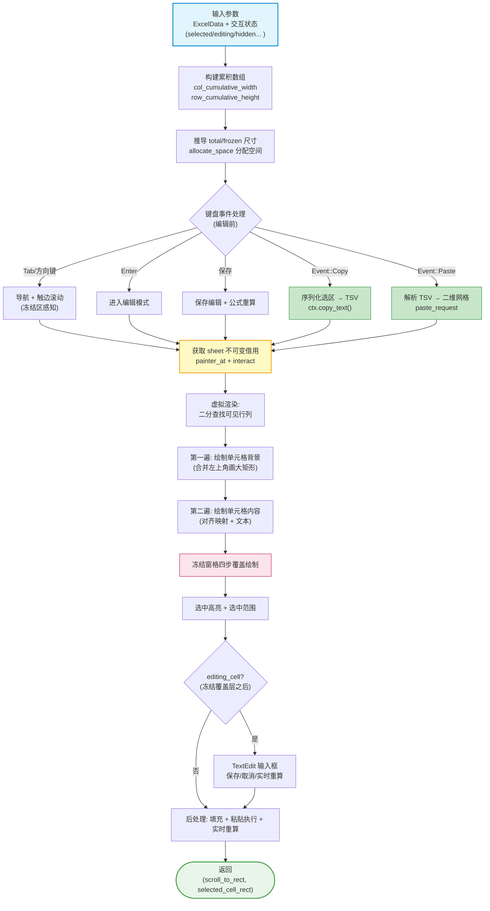
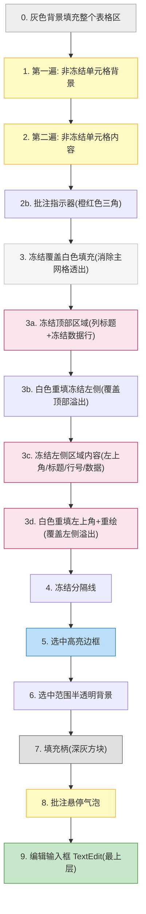
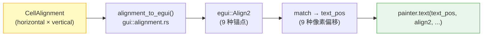

# `gui/widgets/table.rs` 文档

## 1. 文件概述

`src/gui/widgets/table.rs` 是 umya-spreadsheet-excel 项目的 **Excel 表格 UI 渲染层**。它基于 [egui](https://github.com/emilk/egui)（由 `eframe` re-export）即时模式（immediate-mode）GUI 框架，把内存中的 `ExcelData`（见 [`excel::reader`](../../excel/reader.md)）渲染为可交互的电子表格视图，并处理几乎全部的表格交互逻辑。

### 职责定位

该模块是整个 GUI 与用户交互的**核心枢纽**，承担：

- **单元格渲染**：值/公式显示、背景色、字体大小/颜色、对齐方式、列/行标题（A,B,C… / 1,2,3…）。
- **合并单元格**：坐标计算（跨越多行多列的宽高累加）与"仅左上角绘制"的去重绘制策略。
- **冻结窗格（Frozen Panes）**：固定顶部行与左侧列不随滚动移动，通过多层覆盖消除重影。
- **虚拟渲染（Virtual Rendering）**：仅绘制视口内可见的单元格，支持超大表。
- **交互**：点击选中（绿色边框）、**Shift+点击范围选择**（从锚点到目标格的矩形选区）、**键入即编辑（type-to-edit：选中后直接键入即进入编辑并替换原值）**、双击/Enter 编辑、右键上下文菜单、拖拽选择范围、**填充柄拖拽填充（数字序列/日期序列/文本复制/公式相对引用平移）**、**双击填充柄自动填充（按源选区朝向填到「相邻连续数据」边界：横向线向右到行尾、纵向线/单格向下到列底；步长/类型/合并全部复用 `apply_fill`，详见 §2.12）**、**Ctrl+C/Ctrl+V 复制粘贴（单格/矩形区域，TSV 格式，公式保留，支持撤销）**、键盘导航（Tab/方向键/Enter）。
- **编辑与重算**：原位编辑器（透明无边框，直接在单元格内编辑）、数据有效性校验、日期字符串 ↔ 序列号转换、触发 `excel::formula` 增量/全量公式重算；填充柄填充走 `excel::fill::apply_fill`（见 §2.12）。
- **性能优化**：累积尺寸数组 + 二分查找定位、`HashSet` 隐藏行列去重、`Cow` 避免无谓克隆。

### 依赖

| 类别 | 依赖 | 用途 |
|------|------|------|
| 外部 crate | `eframe::egui` | UI 上下文、Painter、输入事件、TextEdit、布局 |
| 内部模块 | `crate::excel::reader` | `CellAlignment`、`CellData`、`ExcelData`、`col_to_letter` |
| 内部模块 | `crate::gui::alignment` | `alignment_to_egui`（对齐方式映射） |
| 内部模块 | `crate::excel::formula` | `evaluate_sheet` / `evaluate_dependents`（公式重算） |
| 内部模块 | `crate::excel::fill` | `apply_fill`（填充柄拖拽填充：格式复制 + 公式相对引用平移）、`compute_fill_values`（只读预计算填充值，供分批跨帧写入）、`FillValues`（预计算结果，含目标格列表与公式标志）、`compute_autofill_target`（双击填充柄：推断自动填充目标边界） |
| 内部模块 | `crate::gui::viewer` | `ContextMenuState`（右键菜单状态）、`PasteCommit`（粘贴撤销信号）、`PendingFill`（分批跨帧填充状态） |
| 标准库 | `std::borrow::Cow` | 文本借用，避免克隆 |
| 标准库 | `std::collections::HashSet` | 隐藏行/列集合 |

### 功能定位一句话

> 把 `ExcelData` 转化为屏幕上的 egui 绘制指令（`Painter`）与交互响应（`Response`），是数据模型与用户之间的唯一渲染通道。

---

## 2. 代码逻辑分析

本文件只定义 **1 个公开函数** `draw_table_content` 和 **1 个私有辅助函数** `cell_display_text`，其余逻辑全部以**闭包（closure）**形式内联在 `draw_table_content` 中。下面按功能模块分层梳理。

### 2.1 单元格文本提取与日期格式转换

```rust
fn cell_display_text<'a>(cell: &'a CellData) -> Cow<'a, str>
```

- 若单元格有 `number_format` 且 `ExcelData::is_date_format(fmt)` 为真，则尝试把 `cell.value` 解析为 `f64` 序列号，经 `ExcelData::format_date` 转为日期字符串（返回 `Cow::Owned`）。
- 否则直接借用 `cell.value`（返回 `Cow::Borrowed`）。
- **性能要点**：用 `Cow` 避免非日期单元格的 `String` 克隆；日期转换才分配新内存。

### 2.2 尺寸模型：累积数组（性能关键）

函数开头一次性构建两个累积数组：

- `col_cumulative_width: Vec<f32>` —— 索引 `i` 存"第 i 列左边缘"的累积 x 坐标。
- `row_cumulative_height: Vec<f32>` —— 索引 `i` 存"第 i 行顶部边缘"的累积 y 坐标。

构建时**隐藏行/列贡献 0 宽/高**（`hidden_columns.contains(&col)` 跳过累加），从而：

- 任意单元格的 x/y 坐标 = `O(1)` 数组索引：`x = tl_x + border + col_cumulative_width[col]`。
- 合并区域宽高 = `O(1)` 差值：`width = col_cumulative_width[end+1] - col_cumulative_width[start] - border`。
- 可见范围 = `O(log n)` 二分查找（`Vec::partition_point`）。
- 点击命中 = 同样 `O(log n)` 二分。

从累积数组直接推导：`total_width/height`、`frozen_left_width`、`frozen_top_height`，替代了原本的循环累加。

### 2.3 坐标转换闭包

| 闭包 | 功能 |
|------|------|
| `get_col_width(col)` | 列宽（像素）= `column_widths` 中值 × 8.0，否则默认 80.0 |
| `get_row_height(row)` | 行高（像素）= `row_heights` 中磅值 × 1.333（磅→像素），且不小于默认 25.0 |
| `get_cell_rect(col, row)` | 仅键盘导航用，返回 (x, y, w, h)，**不在渲染热路径** |
| `is_cell_in_viewport(col, row)` | 判断单元格四边是否在"有效可见区域"（clip_rect 减去冻结区）内 |
| `get_cell_global_rect(col, row)` | 返回单元格屏幕矩形；**合并单元格返回完整合并区域矩形**（用于滚动定位） |
| `screen_to_cell(pos)` | 屏幕坐标 → (col, row)，冻结区感知坐标参考系切换 |
| `expand_to_merge(col, row)` | 把单元格扩展到所在合并区域的 (start_col/row, end_col/row) 边界 |
| `draw_frozen_cell(painter, col, row, x, y)` | 在指定位置绘制冻结区单元格（背景+内容+边框，复用一次 `get_cell`；编辑中的单元格跳过文本，见 §2.10） |

**冻结区坐标参考系**：冻结区域在视口上位置固定（不随滚动变化），用 `viewport_rect.min` 作原点；非冻结区域随滚动，用表格内容坐标 `tl_x/tl_y`。`screen_to_cell` 与点击处理据此切换参考系。

### 2.4 键盘导航（Tab / 方向键 / Enter / 键入即编辑）

- **Tab / Shift+Tab**：编辑模式下保存并退出；非编辑模式下水平切换单元格，行末/行首自动换行。
- **方向键**：上下左右移动选中单元格。
- **Enter**：非编辑模式下进入编辑模式（设置 `just_entered_edit_mode` 标志，忽略同帧的 Enter，避免"进又出"）。
- **键入即编辑（type-to-edit）**：选中单元格后**直接键入**即进入编辑模式，并以输入字符**替换**原内容（Excel 行为）。检测条件：`editing_cell.is_none() && selected_cell.is_some() && !validation_error_active && !context_menu.visible`，**且焦点在表格本身或无焦点**（`focused_id.is_none() || focused_id == Some(Id::new("table_interaction"))`）。表格交互区点击单元格后会 `request_focus`（见 §2.x interact），此时焦点持有者是表格交互区而非 TextEdit——它**不消费 `Event::Text`**，故可安全捕获；而公式栏/名称框/搜索框聚焦时焦点 id 不同则不触发（避免重复处理：egui 的 TextEdit 不会从事件流移除已处理的 `Event::Text`）。字符来源用 `Event::Text`（`input.events`），正确支持 IME/中文；触发后立即 `events.retain` 消费本帧所有 Text 事件，防止同帧新建的 TextEdit 获焦后二次插入。`Backspace`/`Delete` 走 `Event::Key`，不触发本逻辑（Delete 维持 viewer.rs 既有"清空"行为）。

所有方向切换都**感知合并单元格**：进入合并区域时跳到其 `start_col/start_row`（或离开时用 `end_col`），实现"合并区域整体跳格"。

**触边滚动（Edge Scroll）**：仅当目标单元格不在视口内（`!is_cell_in_viewport`）才触发 `ui.scroll_to_rect`，并**补偿冻结窗格**（对比 `effective_min = clip_rect.min + frozen_*` 边界，而非裸 `clip_rect`），复刻 Excel"滚动最小距离使目标可见"的行为。滚动后 `request_repaint()` 立即重绘。

### 2.5 编辑保存与公式重算

编辑值保存时有两条路径（输入框 Enter/失焦 与 Tab 保存），逻辑一致：

1. **公式识别**：`edit_value.starts_with('=')` → 写入 `cell.formula`；否则写入 `cell.value`。
2. **数据有效性校验**：非公式值先 `sheet.validate_cell(col, row, edit_value)`，失败则弹出 `validation_error` 并阻止保存（`original_cell_data` 用于校验失败时恢复）。
3. **日期转换**：若单元格是日期格式，保存值经 `ExcelData::parse_date_string` 转回序列号字符串。
4. **公式重算**：公式变更 → `evaluate_sheet`（全量）；值变更 → `evaluate_dependents(row, col)`（增量）。
5. 置 `*dirty = true` 标记文件已修改。
6. **撤销信号**：写入成功后置 `*committed_edit = Some((edit_row, edit_col))`。本函数不直接接触私有的 `undo_stack`（见 [`viewer.md`](../viewer.md) §2.5），而由调用方在返回后据此信号、配合 `original_cell_data` 重建编辑前快照入撤销栈。仅保存路径置位，Esc 取消/校验失败均不置位——天然区分「保存 vs 取消」。

编辑过程中还有**实时重算**（`editing_cell.is_some() && edit_value != prev_display` 时），边输入边更新依赖公式，提供所见即所得体验。

> **原位编辑（与 Excel 一致）**：编辑态不再叠加额外的输入框控件，而是用透明无边框的 `TextEdit` 直接在单元格原位置编辑（详见 §2.13）。为保证透明输入框下方不透出旧值造成"双重文字"，内容绘制遍会**跳过正在编辑的单元格的文本**：主网格 content pass 在 `*editing_cell == Some((col, row))` 时 `continue`；冻结区渲染器 `draw_frozen_cell` 同样以 `cell_data_for_text = None` 跳过文本（保留背景/边框/批注指示器）。两处都必须跳过——曾因 `draw_frozen_cell` 遗漏此跳过，导致**冻结行/列**单元格双击编辑时旧值与新编辑器叠加成重影，已修复。单元格背景（填充色）照常绘制并透过透明输入框显示。


> **实时重算的副作用与撤销/取消的旧值来源**：实时重算会逐帧把 `edit_value` 写入 `cell.value`，因此到「提交时」`cell` 里已是新值——撤销与 Esc 取消的「编辑前旧值」**不能**取自提交时的当前 cell，而必须取自**进入编辑时**捕获的 `original_cell_data`（值/公式，编辑只改这两项）。据此：
> - **Esc 取消**（TextEdit 路径，`!save_cell`）：用 `original_cell_data` 还原 `cell.value`/`formula` 并重算，否则会残留半成品。
> - **撤销快照**：调用方用「当前 cell 克隆 + 回填 `original_cell_data` 的 value/formula」重建编辑前 `CellData`。

### 2.6 视口虚拟渲染

基于 `viewport_rect` 与 100px `margin`，用 `partition_point` 在累积数组上**二分查找**可见行列范围 `[visible_rows_start..=visible_rows_end]` / `[visible_cols_start..=visible_cols_end]`，后续所有遍历只覆盖该子集。

### 2.7 合并单元格的坐标计算与绘制

通过 `sheet.get_merged_range(col, row)` 查询（reader 内部用 `merge_index` 做 O(1) 查找）：

- **`is_top_left(col, row)`**：判断是否合并区域左上角。
- **非左上角单元格**：`is_merged_part` → 跳过绘制（由左上角代为绘制整个合并背景与内容），避免重叠。
- **左上角单元格**：用累积数组差值计算合并宽高（自动处理隐藏列），一次性绘制大矩形背景与文本。

### 2.8 单元格对齐方式映射

调用 `crate::gui::alignment::alignment_to_egui(&alignment)`，把 `CellAlignment`（horizontal × vertical 组合）映射为 `egui::Align2`（9 种对齐锚点）。General 默认左对齐；CenterContinuous/Fill/Justify/Distributed 归一为居中（见 [alignment.rs](../alignment.md)）。

随后根据返回的 `egui::Align2` 用 `match` 计算 9 种文本定位点（`text_pos`），普通单元格用 `cell_width/cell_height`，合并单元格用 `merged_col_width/merged_row_height` 计算偏移（边距 4.0px）。

### 2.9 两遍绘制（背景 → 内容）

主网格（非冻结区）采用**两遍绘制**：

1. **第一遍（背景）**：遍历可见单元格，画背景色（合并左上角画大矩形，非左上角跳过）。
2. **第二遍（内容）**：遍历可见单元格，画列标题、行标题、数据单元格文本（合并左上角按合并尺寸对齐绘制，非左上角跳过）。

两遍分离保证背景不会覆盖相邻文字，且合并区域只绘制一次。

### 2.10 冻结窗格：四步覆盖绘制（最复杂的部分）

冻结区必须固定在视口顶部/左侧，且要处理**合并单元格的溢出**（如冻结顶部数据行的 `N1:O1` 合并可能向左溢出到冻结左侧区域）。绘制顺序为：

```
前奏：白色填充整个冻结覆盖区域（顶部 + 左侧），遮住主网格在滚动时透出的内容（消除重影）
第1步：绘制顶部冻结区域（列标题 + 冻结数据行，全宽，可能向左溢出）
第2步：白色重填左侧冻结区域，覆盖第1步顶部数据行合并的溢出
第3步：绘制左侧冻结区域内容（左上角、冻结列标题、冻结行号、角落数据、非冻结行号、冻结左侧数据列）
第4步：白色重填左上角区域 + 重绘左上角内容，覆盖第3步左侧数据列向上溢出的部分
最后：绘制冻结分隔线
```

`draw_frozen_cell` 闭包复用：只调用一次 `get_merged_range`、一次 `get_cell`，避免重复 HashMap 查询。合并宽高同样用累积数组差值计算。
**编辑中的单元格**：`draw_frozen_cell` 保留背景/边框/批注指示器绘制，但跳过文本（`let cell_data_for_text = if *editing_cell == Some((col,row)) { None } else { cell_data }`，文本块用 `cell_data_for_text`），由透明原位 TextEdit 渲染——避免冻结区单元格编辑时旧值与新编辑器叠加成重影（与主网格 content pass 的跳过一致；见 §2.5/§2.13）。

### 2.11 选中高亮与选中范围

- **选中边框**：2px **绿色** `rect_stroke`（`Color32::from_rgb(0,176,80)`，`StrokeKind::Outside`）覆盖**整段选区**——优先取 `selected_range` 的包围盒，否则退化为 `selected_cell`（单格时展开到所在合并区域）。与 Excel 一致：填充/框选后绿框覆盖整段选区（含目标格），而非仅活动格。冻结区/非冻结区用不同坐标参考系定位。绿框矩形同时存入 `selected_cell_rect` 返回（供数据有效性弹窗定位）。
- **选中范围内部柔光**（`selected_range`）：半透明蓝色背景（`0,112,192`，α=40）。仅作选区内部提示，外缘边框已统一由绿色选中框绘制（不再单独描边，避免双重边框）。由拖拽选择/填充产生。
- **填充柄（Fill Handle）**：选区右下角 5×5px 深灰方块（`Color32::from_rgb(80,80,80)`），位置取**整段选区右下角**：`selected_range` 优先，否则 `selected_cell` 并展开到所在合并区域（故水平合并 `D9:E9` 的柄落在末端格 `E9` 右下角，而非锚点 `D9`）。绿框为 2px + `StrokeKind::Outside`（画在选区外侧），柄相对选区矩形 `max` 外移 2px（= 绿框厚度），外缘与绿框外拐角对齐、横跨绿框线（Excel 式"压角"，非紧贴内侧）。独立 `ui.interact`（`Id::new("fill_handle")`，`Sense::click_and_drag()`）+ `on_hover_cursor(CursorIcon::Crosshair)`。拖拽它向相邻区域填充（见 §2.13）。

### 2.12 填充柄与填充（Fill Handle）

填充柄拖拽与表格主体的框选拖拽（`table_interaction`）用**独立 interact 分流**——egui 把一次拖拽路由到指针按下时命中的那个 interact，命中柄则走填充、否则走框选。

- **状态**：`fill_drag_source: &mut Option<(u32,u32)>`（持久化在 viewer，跨帧）。`drag_started`（命中柄）时置选区右下角格；`drag_stopped` 时清空。
- **预览**：拖拽中由指针→单元格（`cell_at`，冻结感知）算目标格，结合选区算预览范围（沿单轴：下/上/右/左），蓝色半透明（α=60/160）实时绘制。
- **提交**：`drag_stopped` 写局部 `fill_request = Some((源选区, 目标格))`。**实际写 cell 在函数末尾**（`&mut excel_data` 可用区，仿实时重算块），避免与渲染段 `&sheet` 借用冲突。填充执行采用**两阶段架构**：
  1. **预计算阶段**（只读）：调用 `crate::excel::fill::compute_fill_values`（非 `apply_fill`），仅读取 sheet、推断序列值并收集到 `FillValues`，不执行任何写入操作。
  2. **写入阶段**：根据 `FillValues.cells.len()` 与 `FILL_SYNC_THRESHOLD`（=2000）分流：
     - **同步路径**（`cells.len() <= FILL_SYNC_THRESHOLD`）：单帧完成——逐格写入 `sheet.cells.insert`、逐格维护 `formula_positions` 索引（新格有公式→`mark_formula`；旧格有公式但新格无→`unmark_formula`），然后根据 `has_formula` 选择重算策略（公式→`evaluate_sheet` 全量；仅值→`evaluate_dependents_many` 批量增量），置 `dirty`，选区设为「源 ∪ 目标」，并经 `committed_fill` 通知调用方入撤销栈。
     - **异步路径**（`cells.len() > FILL_SYNC_THRESHOLD`）：创建 `PendingFill`（含预计算值、写入游标 `next_idx=0`、`has_formula`、填充前选区/范围），存入 `pending_fill_request` 出参交由 viewer。viewer 每帧写入 `FILL_BATCH_SIZE`（=2000）格，帧间 UI 正常响应；写入阶段同步维护 `formula_positions` 索引（新格有公式→`mark_formula`；旧格有公式但新格无→`unmark_formula`）。全部写完后统一触发公式重算 + 选区更新 + 撤销入栈。
- **双击自动填充（`handle_resp.double_clicked()`）**：双击填充柄时**不走拖拽**，而是调 `crate::excel::fill::compute_autofill_target(sheet, 源选区, hidden_columns, hidden_rows)` 推断目标格，再写**同一个** `fill_request`——**完全复用拖拽填充的末尾执行块**（`compute_fill_values` 预计算 + 同步/异步分流写入 + 批量重算 + 选区「源∪目标」+ `committed_fill` 撤销），无第二条写入路径。目标推断规则（详见 [`excel/fill`](../../excel/fill.md) `compute_autofill_target`）：
  - **方向按源选区朝向**：横向线（多列单行，如 `AH1:AK1`）→ **仅向右**；纵向线（多行单列，如 `A38:A39`）→ **仅向下**；方向明确的选区不回退另一方向（与 Excel 一致）。单格/方块 → 默认向下，无相邻数据时回退向右；都无则返回 `None`（不填充）。
  - **边界=相邻连续数据末尾**（仿 Excel 双击填充柄）：向下取相邻列（先左后右）从源末行下一行起的连续非空末行；向右取相邻行（先上后下）从源末列右一列起的连续非空末列。用例：`AH1:AI1=17`/`AJ1:AK1=18` + 第 2 行数据延伸到 `AN` → 填到 `AN1`（19/20/21）；`A38="08月17号"`/`A39="08月18号"` + B 列数据延伸到第 44 行 → 填到 `A44`（`08月19号`…`08月23号`）。
  - **合并感知 / 隐藏行列透明**：边界扫描把合并区域折叠为左上角值并跨过整个合并跨度；隐藏行/列不中断连续性。
  - 双击时立即 `*fill_drag_source = None`，使本帧的拖拽预览块/释放块不据此二次写入覆盖目标（双击帧 `drag_started` 与 `double_clicked` 可能同帧为真，靠此清空分流）。
  - 超 `AUTO_FILL_MAX_CELLS`（5 万）时目标被夹紧，防单帧海量写入阻塞 UI（见 [`excel/fill`](../../excel/fill.md) §5 性能）。
- **撤销**：调用方（viewer）据 `committed_fill` 构造 `UndoAction::RangeClear`（恢复 `old_cells` + 选区 + 全表重算），Ctrl+Z 即撤销填充（双击与拖拽填充共用此信号，撤销行为一致）。
- **公式索引维护**：填充写入时同步维护 `formula_positions` 索引：新格有公式→`mark_formula`；旧格有公式但新格无→`unmark_formula`。此规则同步路径在写入循环内逐格执行；异步路径在 viewer 分批写入循环内逐格执行，确保填充完成时索引与 sheet 一致。


### 2.13 原位编辑器（无缝编辑）

`editing_cell` 非空且在可见范围内时，用 `ui.scope_builder(UiBuilder::new().max_rect(edit_rect), ...)` 在单元格**整格矩形**上放一个 `egui::TextEdit::singleline`。编辑态视觉上**与 Excel 一致——无额外输入框/边框**，直接在单元格内显示文本与闪烁光标：

- **透明无边框**：`.frame(egui::Frame::NONE.inner_margin(Margin { left: 4, right: 4, top: vpad, bottom: vpad }))`——去掉默认背景+边框，左右 4px 对齐常规 `painter.text` 的 4.0 偏移。单元格自身背景（填充色）透过透明输入框正常显示。
- **字体/颜色/对齐与单元格一致**：从编辑单元格读出 `font_size`→`FontId`、`font_color`→`text_color`、`alignment`→经 `align2_to_hv` 拆成 `horizontal_align`/`vertical_align`，使编辑态文本与未编辑时位置/样式完全一致。
- **垂直居中 + 撑满行高**：egui 的 `TextEdit` 单行高度恒为"一行文本高度"（**忽略 `min_size.y`**），默认会贴在单元格顶部。这里用对称垂直内边距 `vpad = (cell_height − line_height) / 2`（`line_height = ui.text_style_height(Body)`，clamp 进 `i8`）把单行文本在整格内**垂直居中**，并使 frame 高度 = `line_height + 2·vpad = cell_height`，即**输入框高度与单元格行高一致**。
- **整格占位**：`edit_rect = (x, y, cell_width, cell_height)`（合并单元格时为合并尺寸），`.min_size(整格)` + `.clip_text(false)` 允许编辑时长文本右溢出（贴近 Excel）。
- **避免双重文字**：因输入框透明，编辑期间内容绘制遍（主网格 content pass 与冻结区 `draw_frozen_cell`）都会跳过该单元格的文本，仅由 TextEdit 渲染 `edit_value`；背景/边框照常绘制并透过透明输入框显示（详见 §2.5）。
- 自动聚焦、Ctrl+A 全选（通过 `TextEdit::load_state/store_state` 操纵光标）。
- Enter 保存退出、Escape 取消、点击外部保存退出。
- **Escape 取消会还原编辑前值**：因实时重算已把半成品写入 `cell.value`，Esc 路径（`!save_cell`）用 `original_cell_data` 回填 `value`/`formula` 并重算，避免残留；同时与保存路径区分——仅保存才置 `committed_edit` 触发撤销入栈。
- **编辑模式下不触发单元格级 `Ctrl+Z`**：该守卫在 [`viewer.md`](../viewer.md) §2.5 的全局 `Ctrl+Z` 处理处（`editing_cell.is_none()`），把 `Ctrl+Z` 留给输入框做文本内撤销，并避免弹出栈中无关动作。
- 输入框在冻结覆盖层**之后**绘制，防止覆盖层遮挡。

> 之所以仍使用 `TextEdit` widget（而非手写 painter 编辑器）：egui 中光标、文本选区、剪贴板、CJK IME 均由 `TextEdit` 提供，手写会丢失这些能力。把它做透明无边框并占满整格，即可达到"直接在单元格里编辑"的视觉效果，同时保留全部编辑能力。

### 2.16 Shift+点击范围选择

Excel 风格的 Shift+点击扩展选区：按住 Shift 键并点击另一个单元格，选中以锚点（`shift_click_anchor`）和目标格为对角端点的矩形区域。

- **锚点（`shift_click_anchor`）**：最后一次**非 Shift**点击或键盘导航（Tab/方向键）时的活动单元格。持久化在 viewer，跨帧保持。
- **Shift+点击行为**：
  - 活动单元格（`selected_cell`）**保持不变**（与 Excel 一致）。
  - 锚点和目标格**分别**通过 `sheet.get_merged_range` 展开到各自合并单元格的完整边界，再取包围盒——与拖拽选择的 `expand_to_merge` 逻辑一致（如横向两两合并场景下，选中 C7（属于 BC7 合并）后 Shift+点击 D9（属于 DE9 合并），选区自动扩展为 B7:E9）。
  - 若 Shift+点击锚点本身，清除 `selected_range`（退回单格选中）。
  - 若无锚点（首次操作），视为普通点击。
  - Shift+点击**不触发双击编辑**（仅普通点击才进入编辑模式）。
- **与 viewer.rs 自动清除的协作**：viewer 在 `draw_table_content` 返回后检测 `selected_cell` 是否变化。Shift+点击不改变 `selected_cell`，因此不会触发自动清除，`selected_range` 保留。

### 2.17 复制与粘贴（Ctrl+C / Ctrl+V）

支持对单个单元格或矩形单元格区域执行 Ctrl+C 复制和 Ctrl+V 粘贴，与 Excel 交互行为一致。

> **关键实现要点（曾经的失效根因）**：egui-winit 后端在 `on_keyboard_input` 中会**拦截** `Ctrl+C`/`Ctrl+V`/`Ctrl+X`，分别生成 `egui::Event::Copy`/`Event::Paste(String)`/`Event::Cut` 并**提前 `return`**——**不会**把这些组合键作为 `Event::Key { Key::C / Key::V }` 投递。而 `InputState::key_pressed(Key)` 是扫描 `Event::Key` 记录的（见 [`egui` 源 `input_state/mod.rs`](https://github.com/emilk/egui) `key_pressed`），因此 `input.key_pressed(Key::C)` / `key_pressed(Key::V)` **对 Ctrl+C / Ctrl+V 永远为 false**。
>
> 早期版本用 `key_pressed(Key::C)`/`key_pressed(Key::V)` 检测复制/粘贴，导致**复制完全不触发**（剪贴板从未被写入）、粘贴读到的只是系统剪贴板里残留的旧内容。**正确做法是监听 `Event::Copy` / `Event::Paste`**，二者由 egui-winit 直接生成（粘贴时它会自行读取系统剪贴板填充 `Event::Paste` 的内容）。
>
> 此外，复制/粘贴处理都加了**焦点守卫 `!ui.ctx().text_edit_focused()`**：仅当无 `TextEdit`（公式栏/名称框/原位编辑器）获焦时由表格处理剪贴板；否则放行给对应的 `TextEdit` 自行复制/粘贴其选中文本，避免抢占。

#### 复制（Ctrl+C → Event::Copy）

- **触发条件**：检测到 `Event::Copy`、非编辑模式、有选中单元格、无校验弹窗、**无 `TextEdit` 获焦**。
- **序列化格式**：TSV（Tab-Separated Values）——列间用 `\t` 分隔，行间用 `\n` 分隔。
- **内容**：
  - 有公式的单元格：复制公式文本（保证 `=` 前缀）。
  - 无公式的单元格：复制显示文本（经 `cell_display_text` 处理，日期格式转换为日期字符串）。
  - 空单元格：空字符串（TSV 中仍占据一个 tab 位置）。
- **选区范围**：优先取 `selected_range` 的包围盒；否则为单格。
- **剪贴板写入**：通过 `ui.ctx().copy_text(tsv)` 写入系统剪贴板，支持跨应用粘贴。egui-winit 在 `Ctrl+V` 时读取该系统剪贴板生成 `Event::Paste`，从而构成「复制写剪贴板 → 粘贴读剪贴板」的完整闭环，**无需任何内部缓冲**。
- **事件消费**：`events.retain` 移除 `Event::Copy`，防止后续控件二次处理。

#### 粘贴（Ctrl+V → Event::Paste）

- **触发条件**：检测到 `Event::Paste`（egui-winit 在 `Ctrl+V` 时读取系统剪贴板生成）、非编辑模式、有选中单元格、无校验弹窗、**无 `TextEdit` 获焦**。
- **数据来源**：`Event::Paste` 携带的文本，即系统剪贴板当前内容（egui-winit 已把 `\r\n` 归一为 `\n`，并丢弃空内容）。因此**天然支持跨应用粘贴**（从其他程序复制后直接 Ctrl+V）。
- **解析**：从粘贴文本按 `\n` 和 `\t` 分割为二维字符串网格 `Vec<Vec<String>>`，过滤空行。
- **写入逻辑**（与 Excel 一致）：
  - 以活动单元格（`selected_cell`）为粘贴起点。
  - 每个网格元素写入对应的 `sheet.cells[(row, col)]`：以 `=` 开头的字符串作为公式（写入 `cell.formula`），否则作为值（写入 `cell.value`）。
  - 粘贴区域 = 起点 `(col, row)` 到 `(col + cols - 1, row + rows - 1)`。
- **重算**：含公式则 `evaluate_sheet`（全量）；仅值则一次性批量 `evaluate_dependents_many`（一次建图，替代逐格 `evaluate_dependents`，避免大表 K × O(2M) 卡顿）。
- **选区更新**：粘贴多行或多列时，`selected_range` 更新为覆盖粘贴区域的包围盒；单格粘贴不改变选区。
- **撤销**：通过 `committed_paste: &mut Option<PasteCommit>` 出参通知调用方，viewer 据此构造 `UndoAction::RangeClear` 入撤销栈（保存被覆盖格的原始数据 + 选区）。
- **事件消费**：`events.retain` 移除 `Event::Paste`，防止 TextEdit 等控件二次处理。

> **编辑态放行**：当处于原位编辑（`editing_cell.is_some()`）或公式栏/名称框获焦时，`text_edit_focused()` 为真，本节不拦截 `Event::Copy`/`Event::Paste`，交由对应 `TextEdit` 处理——即在编辑文本时 Ctrl+C/V 作用于正在编辑的文本本身（与 Excel 一致）。

### 2.14 性能相关处理汇总

| 技术 | 位置 | 作用 |
|------|------|------|
| 累积数组 + `partition_point` | 尺寸模型、可见范围、点击命中 | `O(log n)` 查找替代 `O(n)` 循环 |
| `Cow<'a, str>` | `cell_display_text` | 非日期单元格零拷贝借用 |
| `HashSet<u32>` 隐藏行列 | 参数 `hidden_columns/hidden_rows` | `O(1)` 跳过隐藏行列 |
| `draw_frozen_cell` 单次查询 | 冻结区绘制 | 每格只查一次 `get_merged_range`/`get_cell` |
| 虚拟渲染 | 可见范围裁剪 | 仅绘制视口内单元格 |
| 输入事件 `consume_key` | 键盘处理 | 消费已处理按键，防止穿透到菜单栏 |
| `request_repaint` | 滚动后 | 确保滚动立即生效 |
| `compute_fill_values` 分批写入 | 填充执行 | 大填充（>FILL_SYNC_THRESHOLD）分批跨帧写入，UI 不卡顿 |

---

### 2.15 批注指示器与悬停气泡（Comment）

集成自 `CellData.comment`（见 [excel/comments.md](../../excel/comments.md)），采用 Excel 风格：

- **橙红色三角指示器**：模块级函数 `draw_comment_indicator(painter, x, y, width)`，用 `egui::Shape::convex_polygon` 在单元格右上角画 ~7px 橙红色（RGB 217,83,25）实心三角。
  - **主网格非冻结区**：第二遍内容绘制之后的独立遍历，合并非左上角跳过（只在合并左上角画）。
  - **冻结区**：在 `draw_frozen_cell` 闭包末尾调用。
- **悬停气泡**：所有单元格绘制完成后（编辑框之前）一次性指针检测。`response.hovered() && !dragged && editing_cell.is_none() && !validation_error_active` 时，用冻结区感知坐标转换（复用 `partition_point` 二分）定位到单元格，合并单元格自动取左上角；命中带批注单元格则用 `painter.layout_job(LayoutJob::simple(...))` 生成自动换行 galley，绘制淡黄背景（`#FFFFE0`）+ 边框 + 正文（黑色）。**作者头仅当正文未以「作者:」开头时单独显示**（灰色小字）：Excel 把作者名嵌入正文首行（如 `"s:\n..."`），重复显示会产生多余作者行。气泡定位在指针右下方、越界自动翻转并夹紧到视口。
- 指示器与气泡均**只在可见单元格**绘制，与隐藏行/列跳过逻辑一致。

## 3. 视觉结构图

### 3.1 从 ExcelData 到 egui UI 的完整数据流



### 3.2 渲染层次（绘制顺序，后画者在上）



### 3.3 调用层级关系（文本树）

```
draw_table_content(ui, excel_data, current_sheet, ...)
├── cell_display_text(cell)                    [私有: 文本/日期转换]
├── align2_to_hv(align2)                        [私有: Align2 → (水平, 垂直)]
├── draw_comment_indicator(painter, x, y, w)   [私有: 批注红三角]
├── [闭包] get_col_width / get_row_height       [尺寸查表]
├── [构建] col_cumulative_width / row_cumulative_height
├── [闭包] get_cell_rect                        [坐标计算(导航用)]
├── [闭包] is_cell_in_viewport                  [可见性判定]
├── [闭包] get_cell_global_rect                 [屏幕矩形(合并感知)]
├── 键盘处理
│   ├── Tab(编辑/非编辑) → ui.scroll_to_rect + 更新 shift_click_anchor
│   ├── 方向键 → ui.scroll_to_rect + consume_key + 更新 shift_click_anchor
│   ├── Enter → 进入编辑模式
│   ├── 键入即编辑(type-to-edit) → Event::Text 捕获
│   ├── Ctrl+C → 序列化选区 TSV → ctx.copy_text()
│   └── Event::Paste → 解析 TSV → paste_request
├── 点击处理
│   ├── 普通点击 → 更新 selected_cell + shift_click_anchor + 双击编辑
│   └── Shift+点击 → 计算锚点到目标格的矩形范围 → selected_range
├── 保存编辑 → sheet.validate_cell / formula::evaluate_sheet|evaluate_dependents
├── [闭包] screen_to_cell                       [拖拽/框选: 屏幕坐标→单元格]
├── [闭包] expand_to_merge                      [拖拽合并展开]
├── 拖拽选择 → selected_range
├── 绘制: painter.rect_filled / painter.text / painter.rect_stroke
│   ├── 第一遍背景
│   ├── 第二遍内容 → alignment_to_egui (gui::alignment)
│   ├── 批注指示器 → draw_comment_indicator
│   ├── 冻结覆盖初始白色填充(消除重影)
│   ├── 冻结窗格四步覆盖 → draw_frozen_cell
│   ├── 冻结分隔线
│   ├── 选中高亮 / 选中范围
│   ├── 填充柄渲染 + 拖拽预览 + 双击自动填充(compute_autofill_target)
│   ├── 批注悬停气泡
│   └── TextEdit 输入框（冻结覆盖之后绘制）
├── 实时重算 → formula::evaluate_sheet|evaluate_dependents
├── 填充柄: 拖拽(指针→目标格 cell_at) / 双击(compute_autofill_target 推断相邻数据边界) → fill_request
├── 填充执行 → excel::fill::compute_fill_values(源选区, 目标格) → 按 cells.len() 分流:
│   ├── 同步路径(≤FILL_SYNC_THRESHOLD): 逐格写入+mark/unmark_formula → 重算 → committed_fill
│   └── 异步路径(>FILL_SYNC_THRESHOLD): PendingFill(分批跨帧) → viewer 逐帧写入
└── 粘贴执行 → 解析 paste_request → 写入 cells → formula 重算 → committed_paste
```

### 3.4 对齐映射链路



---

## 4. 关键类型与函数清单

### 4.1 公开函数（pub fn）

| 函数 | 签名 | 功能 | 参数 | 返回值 |
|------|------|------|------|--------|
| `draw_table_content` | `(ui, excel_data, current_sheet, selected_cell, selected_range, editing_cell, edit_value, just_entered_edit_mode, validation_error, original_cell_data, committed_edit, context_menu, dirty, drag_anchor, hidden_columns, hidden_rows) -> (Option<egui::Rect>, Option<egui::Rect>)` | 表格渲染与交互的**唯一公开入口**：处理键盘导航、点击/拖拽选择、编辑保存、虚拟渲染、冻结窗格、选中高亮，并返回滚动目标矩形与选中单元格屏幕矩形 | 见下方参数表 | `(scroll_to_rect, selected_cell_rect)` |

#### `draw_table_content` 参数说明

| 参数 | 类型 | 说明 |
|------|------|------|
| `ui` | `&mut egui::Ui` | egui UI 上下文 |
| `excel_data` | `&mut ExcelData` | Excel 数据（可变，用于编辑写入与重算） |
| `current_sheet` | `usize` | 当前工作表索引 |
| `selected_cell` | `&mut Option<(u32, u32)>` | 当前选中单元格 `(col, row)` |
| `selected_range` | `&mut Option<(u32,u32,u32,u32)>` | 拖拽选中的范围 `(start_col, start_row, end_col, end_row)` |
| `editing_cell` | `&mut Option<(u32, u32)>` | 正在编辑的单元格 |
| `edit_value` | `&mut String` | 编辑输入值 |
| `just_entered_edit_mode` | `&mut bool` | 刚进入编辑模式标志（忽略同帧 Enter） |
| `validation_error` | `&mut Option<(String, String)>` | 数据有效性错误 `(title, msg)`，存在时锁定交互 |
| `original_cell_data` | `&mut Option<((u32,u32), String, String)>` | 编辑前原始数据（校验失败恢复、Esc 取消还原、撤销快照重建共用） |
| `committed_edit` | `&mut Option<(u32, u32)>` | 本帧成功提交（保存）的编辑单元格 `(row, col)`。仅两条保存路径在写入成功后置位；调用方据此把编辑入撤销栈。无值＝本帧无提交/取消/校验失败 |
| `context_menu` | `&mut crate::gui::viewer::ContextMenuState` | 右键菜单状态 |
| `dirty` | `&mut bool` | 文件已修改标记 |
| `drag_anchor` | `&mut Option<(u32, u32)>` | 拖拽选择锚点 |
| `fill_drag_source` | `&mut Option<(u32, u32)>` | 填充柄拖拽源锚点（按下柄时的选区右下角格）；`None`＝非填充拖拽 |
| `committed_fill` | `&mut Option<crate::gui::viewer::FillCommit>` | 填充柄提交信号：一次成功填充后写入，调用方据此构造 `UndoAction::RangeClear` 入撤销栈 |
| `hidden_columns` | `&HashSet<u32>` | 隐藏列集合 |
| `hidden_rows` | `&HashSet<u32>` | 隐藏行集合 |
| `shift_click_anchor` | `&mut Option<(u32, u32)>` | Shift+点击锚点（最后一次非 Shift 点击/键盘导航的单元格坐标），用于 Shift+点击范围选择 |
| `committed_paste` | `&mut Option<crate::gui::viewer::PasteCommit>` | 粘贴提交信号：一次成功粘贴后写入，调用方据此构造 `UndoAction::RangeClear` 入撤销栈 |
| `pending_fill_request` | `&mut Option<crate::gui::viewer::PendingFill>` | 大填充（>FILL_SYNC_THRESHOLD）时的分批跨帧填充请求，由 viewer 每帧逐批写入 |

### 4.2 私有函数（fn）

| 函数 | 签名 | 功能 |
|------|------|------|
| `cell_display_text` | `<'a>(cell: &'a CellData) -> Cow<'a, str>` | 提取单元格显示文本；日期格式单元格把序列号转为日期字符串，否则借用 `cell.value`。用 `Cow` 避免克隆 |
| `align2_to_hv` | `(a: egui::Align2) -> (egui::Align, egui::Align)` | 把单元格 `Align2` 拆成（水平, 垂直）两个 `Align`，供原位编辑器 `horizontal_align`/`vertical_align` 与 `painter.text` 对齐一致 |
| `draw_comment_indicator` | `(painter: &egui::Painter, x: f32, y: f32, width: f32)` | 在单元格右上角绘制 ~7px 红色批注指示三角 |

### 4.3 内联闭包（定义于 `draw_table_content` 内）

| 闭包 | 签名摘要 | 功能 |
|------|----------|------|
| `get_col_width` | `(col: u32) -> f32` | 列宽（像素），`column_widths × 8.0` 或默认 80.0 |
| `get_row_height` | `(row: u32) -> f32` | 行高（像素），磅 × 1.333，下限 25.0 |
| `get_cell_rect` | `(col, row) -> (f32,f32,f32,f32)` | 单元格局部矩形 `(x,y,w,h)`，仅导航用 |
| `is_cell_in_viewport` | `(col, row) -> bool` | 单元格四边是否在有效可见区域 |
| `get_cell_global_rect` | `(col, row) -> egui::Rect` | 单元格屏幕矩形；合并单元格返回完整区域 |
| `screen_to_cell` | `(pos: egui::Pos2) -> Option<(u32,u32)>` | 屏幕坐标 → (col,row)，冻结区感知 |
| `expand_to_merge` | `(col, row) -> (u32,u32,u32,u32)` | 扩展到所在合并区域边界 |
| `draw_frozen_cell` | `(painter, col, row, x, y)` | 在 (x,y) 绘制冻结区单元格（背景+内容+边框；编辑中的单元格跳过文本，避免重影） |

### 4.4 自定义类型

> 本文件**不定义任何 `pub struct` / `pub enum`**。所有数据类型复用自 [`excel::reader`](../../excel/reader.md)（`CellData`、`CellAlignment`、`ExcelData`、`col_to_letter`）与 `egui`（`Align2`、`Rect`、`Pos2`、`Color32`、`FontId`、`Stroke`、`StrokeKind`、`Key`、`Modifiers` 等）。

### 4.5 常量

| 常量 | 值 | 含义 |
|------|----|------|
| `default_col_width` | `80.0` | 默认列宽（像素） |
| `default_row_height` | `25.0` | 默认行高（像素） |
| `header_width` | `60.0` | 行号列宽度（像素） |
| `border_width` | `1.0` | 边框宽度（像素） |
| `margin` | `100.0` | 虚拟渲染可见范围边距（像素） |
| `SIZE`（`draw_comment_indicator` 内） | `7.0` | 批注指示三角边长（像素） |
