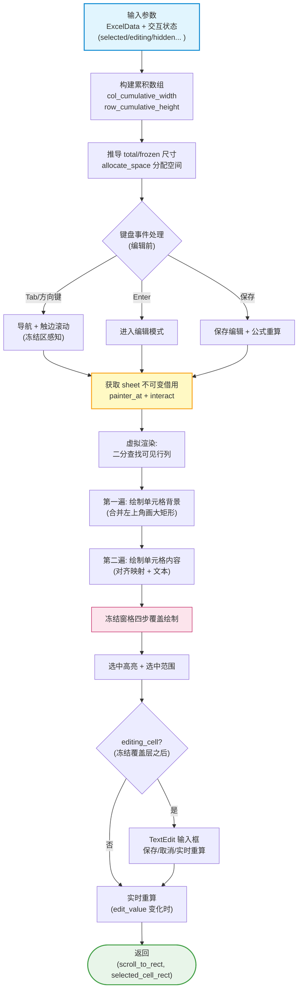
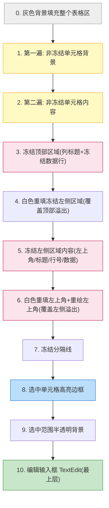

# `gui/widgets/table.rs` 文档

## 1. 文件概述

`src/gui/widgets/table.rs` 是 umya-spreadsheet-excel 项目的 **Excel 表格 UI 渲染层**。它基于 [egui](https://github.com/emilk/egui)（由 `eframe` re-export）即时模式（immediate-mode）GUI 框架，把内存中的 `ExcelData`（见 [`excel::reader`](../../excel/reader.md)）渲染为可交互的电子表格视图，并处理几乎全部的表格交互逻辑。

### 职责定位

该模块是整个 GUI 与用户交互的**核心枢纽**，承担：

- **单元格渲染**：值/公式显示、背景色、字体大小/颜色、对齐方式、列/行标题（A,B,C… / 1,2,3…）。
- **合并单元格**：坐标计算（跨越多行多列的宽高累加）与"仅左上角绘制"的去重绘制策略。
- **冻结窗格（Frozen Panes）**：固定顶部行与左侧列不随滚动移动，通过多层覆盖消除重影。
- **虚拟渲染（Virtual Rendering）**：仅绘制视口内可见的单元格，支持超大表。
- **交互**：点击选中、双击编辑、右键上下文菜单、拖拽选择范围、键盘导航（Tab/方向键/Enter）。
- **编辑与重算**：编辑输入框、数据有效性校验、日期字符串 ↔ 序列号转换、触发 `excel::formula` 增量/全量公式重算。
- **性能优化**：累积尺寸数组 + 二分查找定位、`HashSet` 隐藏行列去重、`Cow` 避免无谓克隆。

### 依赖

| 类别 | 依赖 | 用途 |
|------|------|------|
| 外部 crate | `eframe::egui` | UI 上下文、Painter、输入事件、TextEdit、布局 |
| 内部模块 | `crate::excel::reader` | `CellAlignment`、`CellData`、`ExcelData`、`col_to_letter` |
| 内部模块 | `crate::gui::alignment` | `alignment_to_egui`（对齐方式映射） |
| 内部模块 | `crate::excel::formula` | `evaluate_sheet` / `evaluate_dependents`（公式重算） |
| 内部模块 | `crate::gui::viewer` | `ContextMenuState`（右键菜单状态） |
| 标准库 | `std::borrow::Cow` | 文本借用，避免克隆 |
| 标准库 | `std::collections::HashSet` | 隐藏行/列集合 |

### 功能定位一句话

> 把 `ExcelData` 转化为屏幕上的 egui 绘制指令（`Painter`）与交互响应（`Response`），是数据模型与用户之间的唯一渲染通道。

---

## 2. 代码逻辑分析

本文件只定义 **1 个公开函数** `draw_table_content` 和 **1 个私有辅助函数** `cell_display_text`，其余逻辑全部以**闭包（closure）**形式内联在 `draw_table_content` 中。下面按功能模块分层梳理。

### 2.1 单元格文本提取与日期格式转换

```rust
fn cell_display_text<'a>(cell: &'a CellData) -> Cow<'a, str>
```

- 若单元格有 `number_format` 且 `ExcelData::is_date_format(fmt)` 为真，则尝试把 `cell.value` 解析为 `f64` 序列号，经 `ExcelData::format_date` 转为日期字符串（返回 `Cow::Owned`）。
- 否则直接借用 `cell.value`（返回 `Cow::Borrowed`）。
- **性能要点**：用 `Cow` 避免非日期单元格的 `String` 克隆；日期转换才分配新内存。

### 2.2 尺寸模型：累积数组（性能关键）

函数开头一次性构建两个累积数组：

- `col_cumulative_width: Vec<f32>` —— 索引 `i` 存"第 i 列左边缘"的累积 x 坐标。
- `row_cumulative_height: Vec<f32>` —— 索引 `i` 存"第 i 行顶部边缘"的累积 y 坐标。

构建时**隐藏行/列贡献 0 宽/高**（`hidden_columns.contains(&col)` 跳过累加），从而：

- 任意单元格的 x/y 坐标 = `O(1)` 数组索引：`x = tl_x + border + col_cumulative_width[col]`。
- 合并区域宽高 = `O(1)` 差值：`width = col_cumulative_width[end+1] - col_cumulative_width[start] - border`。
- 可见范围 = `O(log n)` 二分查找（`Vec::partition_point`）。
- 点击命中 = 同样 `O(log n)` 二分。

从累积数组直接推导：`total_width/height`、`frozen_left_width`、`frozen_top_height`，替代了原本的循环累加。

### 2.3 坐标转换闭包

| 闭包 | 功能 |
|------|------|
| `get_col_width(col)` | 列宽（像素）= `column_widths` 中值 × 8.0，否则默认 80.0 |
| `get_row_height(row)` | 行高（像素）= `row_heights` 中磅值 × 1.333（磅→像素），且不小于默认 25.0 |
| `get_cell_rect(col, row)` | 仅键盘导航用，返回 (x, y, w, h)，**不在渲染热路径** |
| `is_cell_in_viewport(col, row)` | 判断单元格四边是否在"有效可见区域"（clip_rect 减去冻结区）内 |
| `get_cell_global_rect(col, row)` | 返回单元格屏幕矩形；**合并单元格返回完整合并区域矩形**（用于滚动定位） |
| `screen_to_cell(pos)` | 屏幕坐标 → (col, row)，冻结区感知坐标参考系切换 |
| `expand_to_merge(col, row)` | 把单元格扩展到所在合并区域的 (start_col/row, end_col/row) 边界 |
| `draw_frozen_cell(painter, col, row, x, y)` | 在指定位置绘制冻结区单元格（背景+内容+边框，复用一次 `get_cell`） |

**冻结区坐标参考系**：冻结区域在视口上位置固定（不随滚动变化），用 `viewport_rect.min` 作原点；非冻结区域随滚动，用表格内容坐标 `tl_x/tl_y`。`screen_to_cell` 与点击处理据此切换参考系。

### 2.4 键盘导航（Tab / 方向键 / Enter）

- **Tab / Shift+Tab**：编辑模式下保存并退出；非编辑模式下水平切换单元格，行末/行首自动换行。
- **方向键**：上下左右移动选中单元格。
- **Enter**：非编辑模式下进入编辑模式（设置 `just_entered_edit_mode` 标志，忽略同帧的 Enter，避免"进又出"）。

所有方向切换都**感知合并单元格**：进入合并区域时跳到其 `start_col/start_row`（或离开时用 `end_col`），实现"合并区域整体跳格"。

**触边滚动（Edge Scroll）**：仅当目标单元格不在视口内（`!is_cell_in_viewport`）才触发 `ui.scroll_to_rect`，并**补偿冻结窗格**（对比 `effective_min = clip_rect.min + frozen_*` 边界，而非裸 `clip_rect`），复刻 Excel"滚动最小距离使目标可见"的行为。滚动后 `request_repaint()` 立即重绘。

### 2.5 编辑保存与公式重算

编辑值保存时有两条路径（输入框 Enter/失焦 与 Tab 保存），逻辑一致：

1. **公式识别**：`edit_value.starts_with('=')` → 写入 `cell.formula`；否则写入 `cell.value`。
2. **数据有效性校验**：非公式值先 `sheet.validate_cell(col, row, edit_value)`，失败则弹出 `validation_error` 并阻止保存（`original_cell_data` 用于校验失败时恢复）。
3. **日期转换**：若单元格是日期格式，保存值经 `ExcelData::parse_date_string` 转回序列号字符串。
4. **公式重算**：公式变更 → `evaluate_sheet`（全量）；值变更 → `evaluate_dependents(row, col)`（增量）。
5. 置 `*dirty = true` 标记文件已修改。
6. **撤销信号**：写入成功后置 `*committed_edit = Some((edit_row, edit_col))`。本函数不直接接触私有的 `undo_stack`（见 [`viewer.md`](../../viewer.md) §2.5），而由调用方在返回后据此信号、配合 `original_cell_data` 重建编辑前快照入撤销栈。仅保存路径置位，Esc 取消/校验失败均不置位——天然区分「保存 vs 取消」。

编辑过程中还有**实时重算**（`editing_cell.is_some() && edit_value != prev_display` 时），边输入边更新依赖公式，提供所见即所得体验。

> **实时重算的副作用与撤销/取消的旧值来源**：实时重算会逐帧把 `edit_value` 写入 `cell.value`，因此到「提交时」`cell` 里已是新值——撤销与 Esc 取消的「编辑前旧值」**不能**取自提交时的当前 cell，而必须取自**进入编辑时**捕获的 `original_cell_data`（值/公式，编辑只改这两项）。据此：
> - **Esc 取消**（TextEdit 路径，`!save_cell`）：用 `original_cell_data` 还原 `cell.value`/`formula` 并重算，否则会残留半成品。
> - **撤销快照**：调用方用「当前 cell 克隆 + 回填 `original_cell_data` 的 value/formula」重建编辑前 `CellData`。

### 2.6 视口虚拟渲染

基于 `viewport_rect` 与 100px `margin`，用 `partition_point` 在累积数组上**二分查找**可见行列范围 `[visible_rows_start..=visible_rows_end]` / `[visible_cols_start..=visible_cols_end]`，后续所有遍历只覆盖该子集。

### 2.7 合并单元格的坐标计算与绘制

通过 `sheet.get_merged_range(col, row)` 查询（reader 内部用 `merge_index` 做 O(1) 查找）：

- **`is_top_left(col, row)`**：判断是否合并区域左上角。
- **非左上角单元格**：`is_merged_part` → 跳过绘制（由左上角代为绘制整个合并背景与内容），避免重叠。
- **左上角单元格**：用累积数组差值计算合并宽高（自动处理隐藏列），一次性绘制大矩形背景与文本。

### 2.8 单元格对齐方式映射

调用 `crate::gui::alignment::alignment_to_egui(&alignment)`，把 `CellAlignment`（horizontal × vertical 组合）映射为 `egui::Align2`（9 种对齐锚点）。General 默认左对齐；CenterContinuous/Fill/Justify/Distributed 归一为居中（见 [alignment.rs](../alignment.md)）。

随后根据返回的 `egui::Align2` 用 `match` 计算 9 种文本定位点（`text_pos`），普通单元格用 `cell_width/cell_height`，合并单元格用 `merged_col_width/merged_row_height` 计算偏移（边距 4.0px）。

### 2.9 两遍绘制（背景 → 内容）

主网格（非冻结区）采用**两遍绘制**：

1. **第一遍（背景）**：遍历可见单元格，画背景色（合并左上角画大矩形，非左上角跳过）。
2. **第二遍（内容）**：遍历可见单元格，画列标题、行标题、数据单元格文本（合并左上角按合并尺寸对齐绘制，非左上角跳过）。

两遍分离保证背景不会覆盖相邻文字，且合并区域只绘制一次。

### 2.10 冻结窗格：四步覆盖绘制（最复杂的部分）

冻结区必须固定在视口顶部/左侧，且要处理**合并单元格的溢出**（如冻结顶部数据行的 `N1:O1` 合并可能向左溢出到冻结左侧区域）。绘制顺序为：

```
第1步：绘制顶部冻结区域（列标题 + 冻结数据行，全宽，可能向左溢出）
第2步：白色重填左侧冻结区域，覆盖第1步顶部数据行合并的溢出
第3步：绘制左侧冻结区域内容（左上角、冻结列标题、冻结行号、角落数据、非冻结行号、冻结左侧数据列）
第4步：白色重填左上角区域 + 重绘左上角内容，覆盖第3步左侧数据列向上溢出的部分
最后：绘制冻结分隔线
```

`draw_frozen_cell` 闭包复用：只调用一次 `get_merged_range`、一次 `get_cell`，避免重复 HashMap 查询。合并宽高同样用累积数组差值计算。

### 2.11 选中高亮与选中范围

- **选中单元格**（`selected_cell`）：2px 蓝色 `rect_stroke`（`StrokeKind::Outside`）。合并单元格自动扩展到完整区域。冻结区/非冻结区用不同坐标参考系定位。保存屏幕矩形到 `selected_cell_rect` 返回（供数据有效性弹窗定位）。
- **选中范围**（`selected_range`）：半透明蓝色背景 + 边框。由拖拽选择产生。

### 2.12 编辑输入框

`editing_cell` 非空且在可见范围内时，用 `ui.scope_builder(UiBuilder::new().max_rect(edit_rect), ...)` 在单元格位置叠加一个 `egui::TextEdit::singleline`：

- 自动聚焦、Ctrl+A 全选（通过 `TextEdit::load_state/store_state` 操纵光标）。
- Enter 保存退出、Escape 取消、点击外部保存退出。
- **Escape 取消会还原编辑前值**：因实时重算已把半成品写入 `cell.value`，Esc 路径（`!save_cell`）用 `original_cell_data` 回填 `value`/`formula` 并重算，避免残留；同时与保存路径区分——仅保存才置 `committed_edit` 触发撤销入栈。
- **编辑模式下不触发单元格级 `Ctrl+Z`**：该守卫在 [`viewer.md`](../../viewer.md) §2.5 的全局 `Ctrl+Z` 处理处（`editing_cell.is_none()`），把 `Ctrl+Z` 留给输入框做文本内撤销，并避免弹出栈中无关动作。
- 输入框在冻结覆盖层**之后**绘制，防止覆盖层遮挡。

### 2.13 性能相关处理汇总

| 技术 | 位置 | 作用 |
|------|------|------|
| 累积数组 + `partition_point` | 尺寸模型、可见范围、点击命中 | `O(log n)` 查找替代 `O(n)` 循环 |
| `Cow<'a, str>` | `cell_display_text` | 非日期单元格零拷贝借用 |
| `HashSet<u32>` 隐藏行列 | 参数 `hidden_columns/hidden_rows` | `O(1)` 跳过隐藏行列 |
| `draw_frozen_cell` 单次查询 | 冻结区绘制 | 每格只查一次 `get_merged_range`/`get_cell` |
| 虚拟渲染 | 可见范围裁剪 | 仅绘制视口内单元格 |
| 输入事件 `consume_key` | 键盘处理 | 消费已处理按键，防止穿透到菜单栏 |
| `request_repaint` | 滚动后 | 确保滚动立即生效 |

---

### 2.14 批注指示器与悬停气泡（Comment）

集成自 `CellData.comment`（见 [excel/comments.md](../../excel/comments.md)），采用 Excel 风格：

- **红色三角指示器**：模块级函数 `draw_comment_indicator(painter, x, y, width)`，用 `egui::Shape::convex_polygon` 在单元格右上角画 ~7px 红色实心三角。
  - **主网格非冻结区**：第二遍内容绘制之后的独立遍历，合并非左上角跳过（只在合并左上角画）。
  - **冻结区**：在 `draw_frozen_cell` 闭包末尾调用。
- **悬停气泡**：所有单元格绘制完成后（编辑框之前）一次性指针检测。`response.hovered() && !dragged && editing_cell.is_none() && !validation_error_active` 时，用冻结区感知坐标转换（复用 `partition_point` 二分）定位到单元格，合并单元格自动取左上角；命中带批注单元格则用 `painter.layout_job(LayoutJob::simple(...))` 生成自动换行 galley，绘制淡黄背景（`#FFFFE0`）+ 边框 + 正文（黑色）。**作者头仅当正文未以「作者:」开头时单独显示**（灰色小字）：Excel 把作者名嵌入正文首行（如 `"s:\n..."`），重复显示会产生多余作者行。气泡定位在指针右下方、越界自动翻转并夹紧到视口。
- 指示器与气泡均**只在可见单元格**绘制，与隐藏行/列跳过逻辑一致。

## 3. 视觉结构图

### 3.1 从 ExcelData 到 egui UI 的完整数据流



### 3.2 渲染层次（绘制顺序，后画者在上）



### 3.3 调用层级关系（文本树）

```
draw_table_content(ui, excel_data, current_sheet, ...)
├── cell_display_text(cell)                    [私有: 文本/日期转换]
├── [闭包] get_col_width / get_row_height       [尺寸查表]
├── [构建] col_cumulative_width / row_cumulative_height
├── [闭包] get_cell_rect                        [坐标计算(导航用)]
├── [闭包] is_cell_in_viewport                  [可见性判定]
├── [闭包] get_cell_global_rect                 [屏幕矩形(合并感知)]
├── 键盘处理
│   ├── Tab(编辑/非编辑) → ui.scroll_to_rect
│   ├── 方向键 → ui.scroll_to_rect + consume_key
│   └── Enter → 进入编辑模式
├── 保存编辑 → sheet.validate_cell / formula::evaluate_sheet|evaluate_dependents
├── [闭包] screen_to_cell                       [点击命中]
├── [闭包] expand_to_merge                      [拖拽合并展开]
├── 拖拽选择 → selected_range
├── 绘制: painter.rect_filled / painter.text / painter.rect_stroke
│   ├── 第一遍背景
│   ├── 第二遍内容 → alignment_to_egui (gui::alignment)
│   ├── [闭包] draw_frozen_cell                 [冻结区单元格]
│   ├── 冻结窗格四步覆盖
│   ├── 选中高亮 / 选中范围
│   └── TextEdit 输入框
└── 实时重算 → formula::evaluate_dependents
```

### 3.4 对齐映射链路


---

## 4. 关键类型与函数清单

### 4.1 公开函数（pub fn）

| 函数 | 签名 | 功能 | 参数 | 返回值 |
|------|------|------|------|--------|
| `draw_table_content` | `(ui, excel_data, current_sheet, selected_cell, selected_range, editing_cell, edit_value, just_entered_edit_mode, validation_error, original_cell_data, committed_edit, context_menu, dirty, drag_anchor, hidden_columns, hidden_rows) -> (Option<egui::Rect>, Option<egui::Rect>)` | 表格渲染与交互的**唯一公开入口**：处理键盘导航、点击/拖拽选择、编辑保存、虚拟渲染、冻结窗格、选中高亮，并返回滚动目标矩形与选中单元格屏幕矩形 | 见下方参数表 | `(scroll_to_rect, selected_cell_rect)` |

#### `draw_table_content` 参数说明

| 参数 | 类型 | 说明 |
|------|------|------|
| `ui` | `&mut egui::Ui` | egui UI 上下文 |
| `excel_data` | `&mut ExcelData` | Excel 数据（可变，用于编辑写入与重算） |
| `current_sheet` | `usize` | 当前工作表索引 |
| `selected_cell` | `&mut Option<(u32, u32)>` | 当前选中单元格 `(col, row)` |
| `selected_range` | `&mut Option<(u32,u32,u32,u32)>` | 拖拽选中的范围 `(start_col, start_row, end_col, end_row)` |
| `editing_cell` | `&mut Option<(u32, u32)>` | 正在编辑的单元格 |
| `edit_value` | `&mut String` | 编辑输入值 |
| `just_entered_edit_mode` | `&mut bool` | 刚进入编辑模式标志（忽略同帧 Enter） |
| `validation_error` | `&mut Option<(String, String)>` | 数据有效性错误 `(title, msg)`，存在时锁定交互 |
| `original_cell_data` | `&mut Option<((u32,u32), String, String)>` | 编辑前原始数据（校验失败恢复、Esc 取消还原、撤销快照重建共用） |
| `committed_edit` | `&mut Option<(u32, u32)>` | 本帧成功提交（保存）的编辑单元格 `(row, col)`。仅两条保存路径在写入成功后置位；调用方据此把编辑入撤销栈。无值＝本帧无提交/取消/校验失败 |
| `context_menu` | `&mut crate::gui::viewer::ContextMenuState` | 右键菜单状态 |
| `dirty` | `&mut bool` | 文件已修改标记 |
| `drag_anchor` | `&mut Option<(u32, u32)>` | 拖拽选择锚点 |
| `hidden_columns` | `&HashSet<u32>` | 隐藏列集合 |
| `hidden_rows` | `&HashSet<u32>` | 隐藏行集合 |

### 4.2 私有函数（fn）

| 函数 | 签名 | 功能 |
|------|------|------|
| `cell_display_text` | `<'a>(cell: &'a CellData) -> Cow<'a, str>` | 提取单元格显示文本；日期格式单元格把序列号转为日期字符串，否则借用 `cell.value`。用 `Cow` 避免克隆 |
| `draw_comment_indicator` | `(painter: &egui::Painter, x: f32, y: f32, width: f32)` | 在单元格右上角绘制 ~7px 红色批注指示三角 |

### 4.3 内联闭包（定义于 `draw_table_content` 内）

| 闭包 | 签名摘要 | 功能 |
|------|----------|------|
| `get_col_width` | `(col: u32) -> f32` | 列宽（像素），`column_widths × 8.0` 或默认 80.0 |
| `get_row_height` | `(row: u32) -> f32` | 行高（像素），磅 × 1.333，下限 25.0 |
| `get_cell_rect` | `(col, row) -> (f32,f32,f32,f32)` | 单元格局部矩形 `(x,y,w,h)`，仅导航用 |
| `is_cell_in_viewport` | `(col, row) -> bool` | 单元格四边是否在有效可见区域 |
| `get_cell_global_rect` | `(col, row) -> egui::Rect` | 单元格屏幕矩形；合并单元格返回完整区域 |
| `screen_to_cell` | `(pos: egui::Pos2) -> Option<(u32,u32)>` | 屏幕坐标 → (col,row)，冻结区感知 |
| `expand_to_merge` | `(col, row) -> (u32,u32,u32,u32)` | 扩展到所在合并区域边界 |
| `draw_frozen_cell` | `(painter, col, row, x, y)` | 在 (x,y) 绘制冻结区单元格（背景+内容+边框） |

### 4.4 自定义类型

> 本文件**不定义任何 `pub struct` / `pub enum`**。所有数据类型复用自 [`excel::reader`](../../excel/reader.md)（`CellData`、`CellAlignment`、`ExcelData`、`HorizontalAlignment`、`VerticalAlignment`、`col_to_letter`）与 `egui`（`Align2`、`Rect`、`Pos2`、`Color32`、`FontId`、`Stroke`、`StrokeKind`、`Key`、`Modifiers` 等）。

### 4.5 常量

| 常量 | 值 | 含义 |
|------|----|------|
| `default_col_width` | `80.0` | 默认列宽（像素） |
| `default_row_height` | `25.0` | 默认行高（像素） |
| `header_width` | `60.0` | 行号列宽度（像素） |
| `border_width` | `1.0` | 边框宽度（像素） |
| `margin` | `100.0` | 虚拟渲染可见范围边距（像素） |
| `SIZE`（`draw_comment_indicator` 内） | `7.0` | 批注指示三角边长（像素） |
